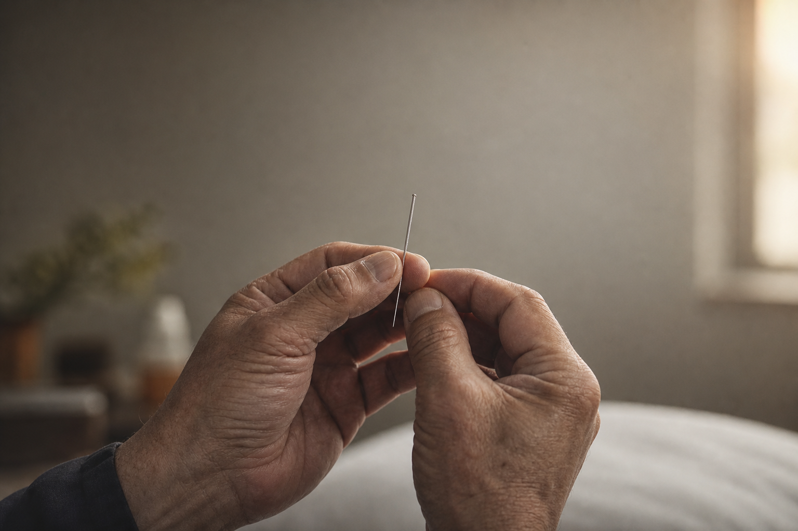
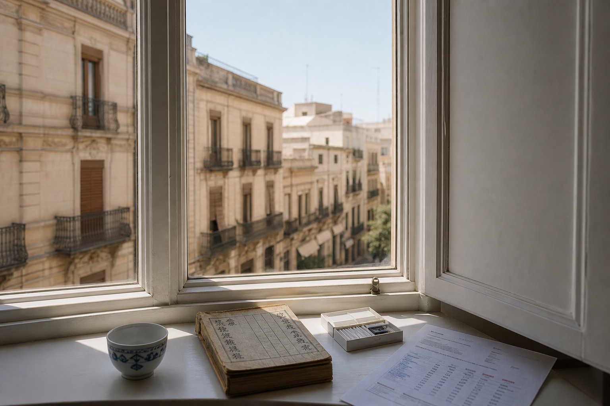
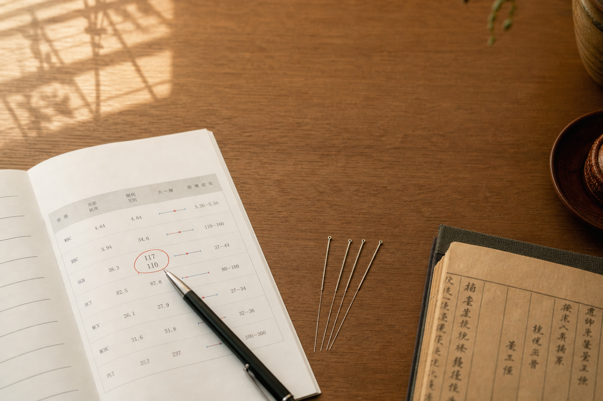
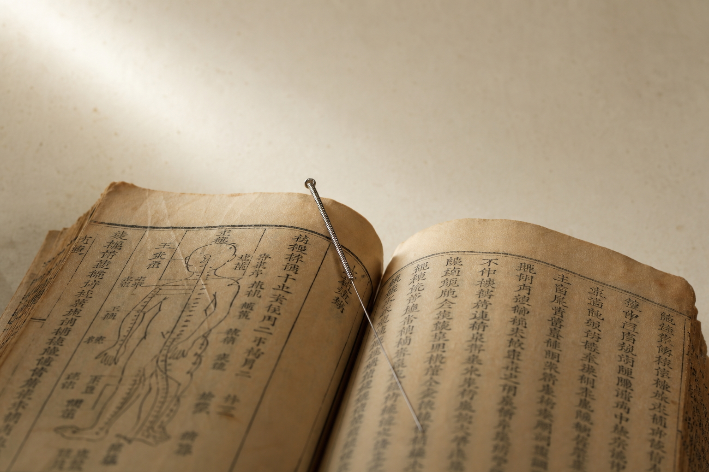
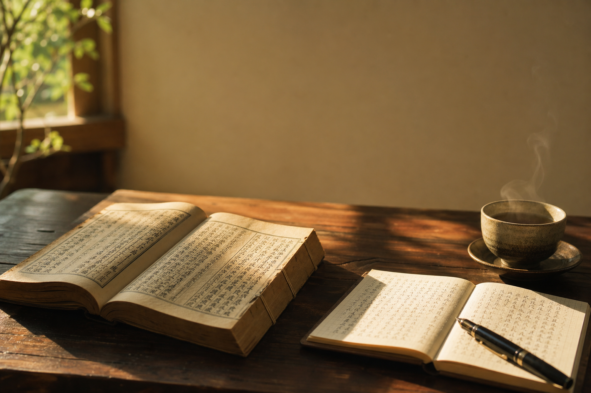
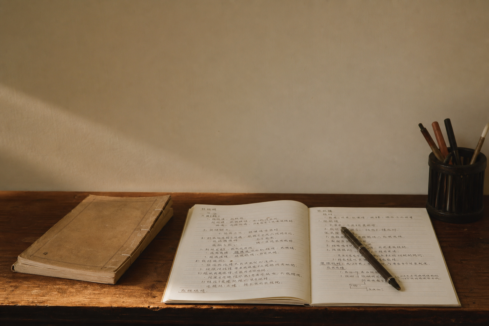

> 写在最前:这是一个学习笔记系列。我不是中医,也没打算成为中医。我读得慢、读得浅,会读错,欢迎指正——但请不要把我写的任何东西当作就医建议。

---

## 一个不太想学医的孩子

我爸这辈子几乎都在给人扎针。

从小到大,家里饭桌上的话题、客厅里来来去去的人、过年过节亲戚朋友的寒暄,几乎都绕着他这门手艺转。这意味着两件事:一,我对中医并不陌生,小毛小病自己捏几下、按几下、艾灸一下,是耳濡目染几十年下来的肌肉记忆;二,正因为太熟,反而不想学。

不想学的理由也很朴素——我不靠这个吃饭。这不是凡尔赛,是真心话。一门手艺如果不打算赖以为生,从小看着长大的人反而最容易"看够了"。

所以很长一段时间,中医对我来说就是一种"家里有,但不专门学"的东西。

---

## 搬到西班牙之后,事情变了

后来我移民到西班牙。

在这边生活久了会发现一个微妙的事:很多很真实、很日常的不舒服——睡不好、吃不下、月经不调、长期疲劳、说不清道不明的小症状——拿去看西医,常常得到的反馈是"检查一切正常"。

这边的医疗体系没有"上火""寒了""湿气重"这样的解释框架。查不出器质性病变,你就只能带着这些不舒服继续过日子。

不是谁对谁错——是两套语言的问题。

---

## 转折来自一个朋友的病例

去年,一个在西班牙的中国朋友找到我。崩漏,持续出血几个月,血红蛋白掉到参考值的一半。在当地看了,激素方案加补铁,效果有限。

我把情况告诉我爸。他远程给了一套针灸思路,我在西班牙执行。

几次扎下来,出血停了。

---

## 前两天,她发了新报告

3月9日: Hb 6.20
4月24日: Hb 7.80

红细胞、红细胞压积、MCV,每一项都在往上走。

我以前也帮人做过类似的——自己觉得"应该没问题"的那种信心。但数据摆在面前,比任何感觉都踏实。

---

## 我必须先说清楚

她也在吃补铁药。指标改善有多少是针灸的功劳、多少是铁剂的功劳,我分不清。

但有一个细节我心里清楚——这个问题她以前犯过几次,每次都是"吃铁能升,停铁就回"。这次,没反复。

单一案例下不了"针灸有效"的结论,但作为一个学习者,这个数据点足以让我意识到:

**我手上能接触到的这套东西,比我以为的更值得认真学。**

---

## 为什么从《黄帝内经》开始?

学习总要有个"头"。

《内经》不教你扎针,也不教你开方。它讲的是中医"怎么看人、看天、看病"的底层世界观。后世所有重要典籍——《伤寒》《金匮》《脉经》《本草》——都默认你已经接受了它的思维。

它是最底层的东西,也是最好的起点。

---

## 关于这个系列,先说在前

1. 我是学渣,不是老师
2. 不开方、不诊断、不远程看病
3. 进度很慢,十年读不完都正常
4. 读不懂就老实留坑,不装懂

---

## 下一篇预告

从这一句开始——

> 上古之人,其知道者,法于阴阳,和于术数……

"法于阴阳"四个字像鳗鱼,怎么都抓不住。

