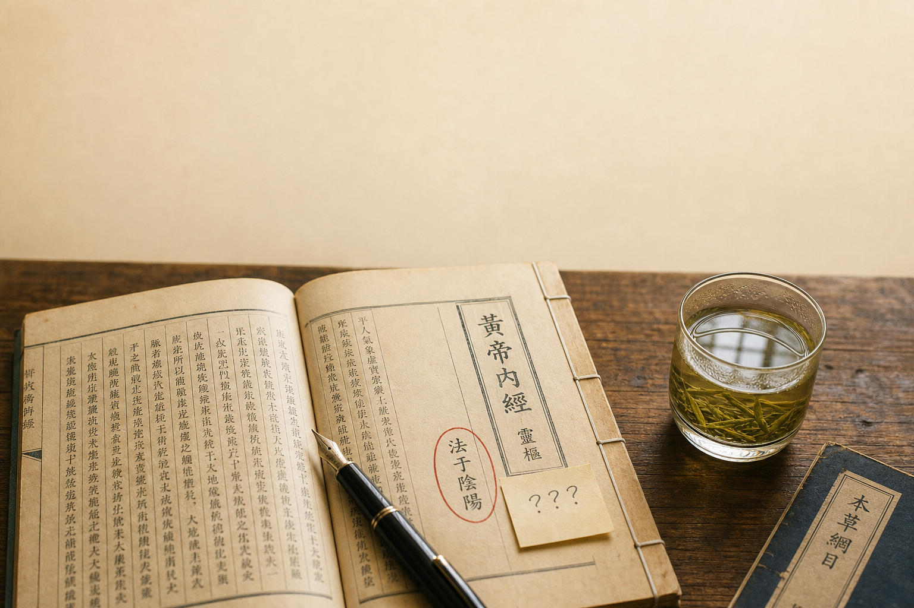
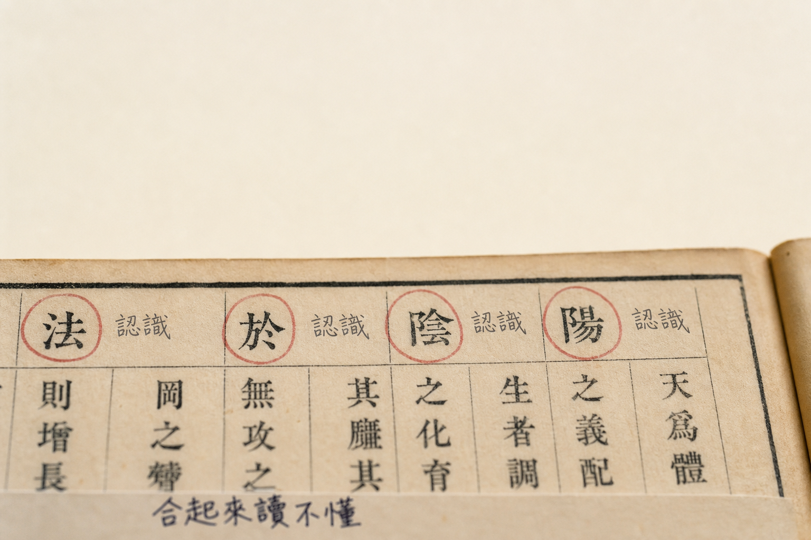
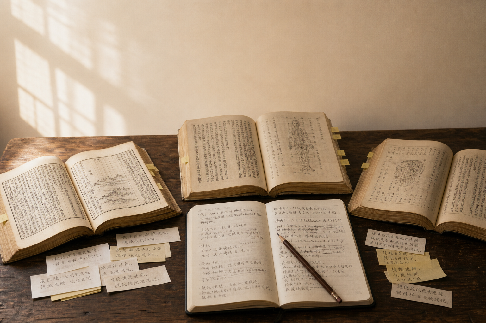

## 今天这段

《素问·上古天真论》开篇:

> 上古之人,其知道者,法于阴阳,和于术数,食饮有节,起居有常,不妄作劳,故能形与神俱,而尽终其天年,度百岁乃去。

字面上没什么生僻字。我是个学渣,但我汉字还是认识的。

问题恰恰在这里——**字都认识,合起来读不懂**。

## 第一遍读:像鸡汤

我第一遍读完的感受非常诚实:这不就是一段两千年前的养生鸡汤吗?

翻译过来差不多是:早睡早起,规律饮食,别瞎折腾,就能活到一百岁。

跟我妈在家庭群里转的养生文章几乎一模一样。但问题就在这里——如果《内经》只是想告诉你"早睡早起身体好",它不需要用几千字来写。

## 第二遍读:查注

我翻开王冰的注、马莳的注、张介宾的注,发现一个有意思的事——每个人解释都不一样。

王冰说"法于阴阳"是顺应四时;马莳强调养生之道;张介宾说阴阳者天地之道也……

三个人各有侧重,没有一个人说"这不就是"。我突然意识到:我之所以觉得像鸡汤,是因为我读得太浅了。

## 第三遍读:法于阴阳是什么?

法于阴阳,说白了就是"跟着太阳走"。

白天活动,晚上休息。春夏多出门,秋冬多收藏。就这么简单,也这么难。难的不是理解,是做到。

我看看自己的作息:凌晨一点还在刷手机,早上九点才起床。这叫"法于阴阳"吗?这叫"逆于阴阳"。

## 留个坑

"和于术数"是什么意思?我查了几家,说法不一。这个坑先留着,以后读到相关篇章再回来填。

学渣的好处就是:不懂就承认,不用装。

## 古人养生:不是吃补品

法于阴阳,和于术数,食饮有节,起居有常,不妄作劳——这五条,没有一条是"吃什么"。

古人养生的核心,是建立一套可持续的日常生活秩序。不是什么高深的功法,是你每天怎么睡、怎么吃、怎么动。

我不是理解透彻了再动手,我是边做边懂。别卡在第一步。

## 下一篇预告

第二篇:古人骂街,两千年没过期。那个"今时之人",说的是你吗?

