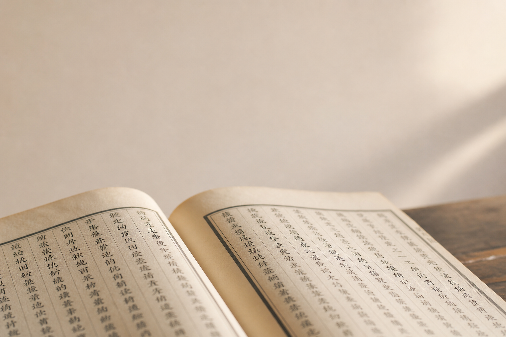
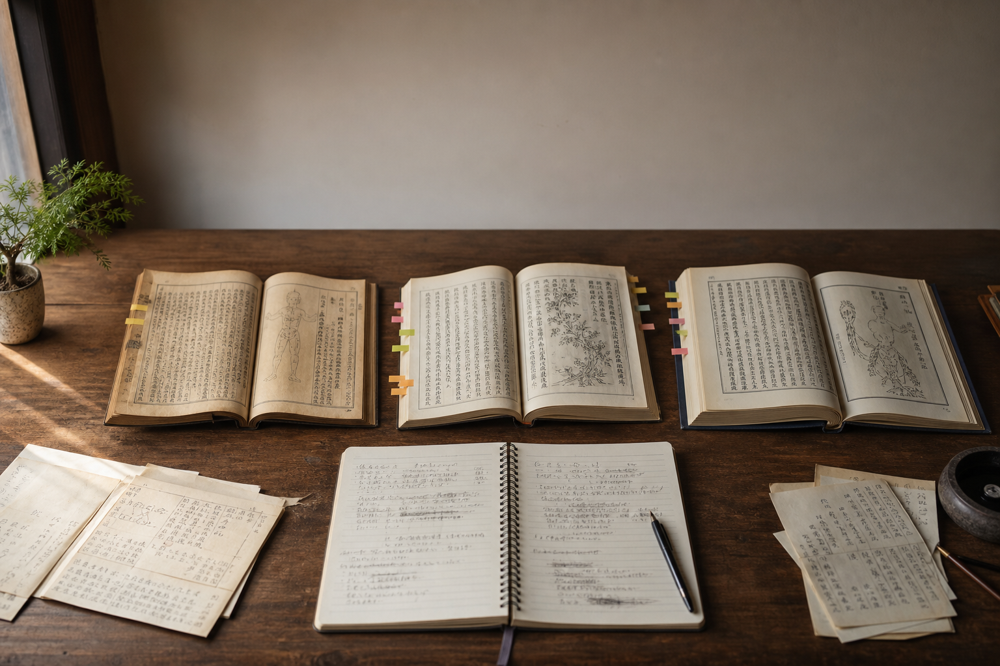
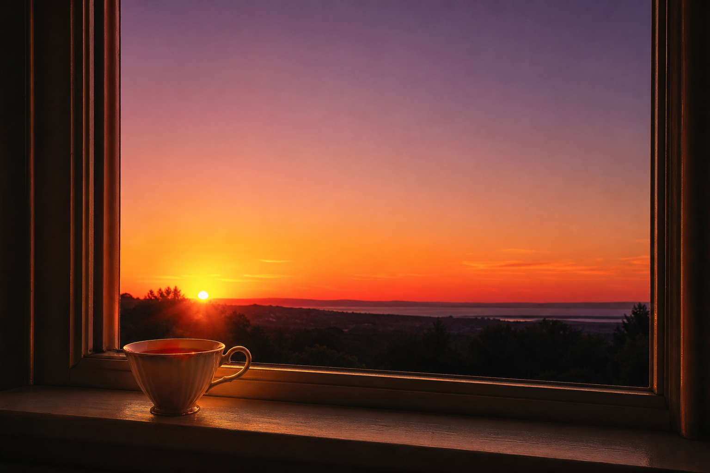
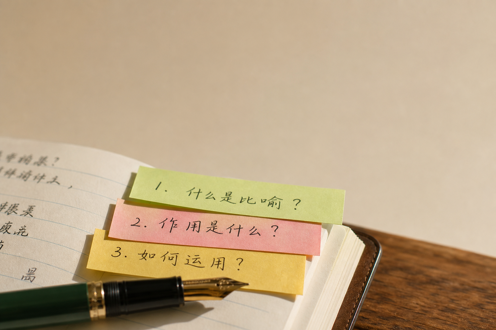
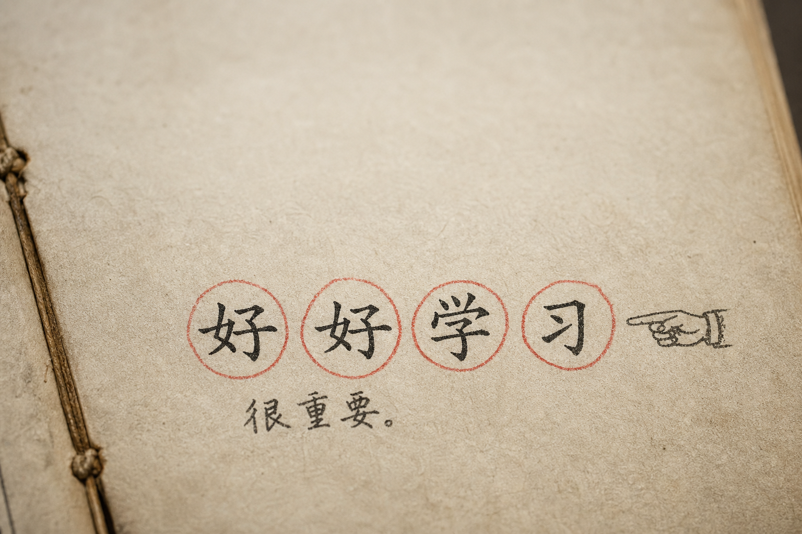
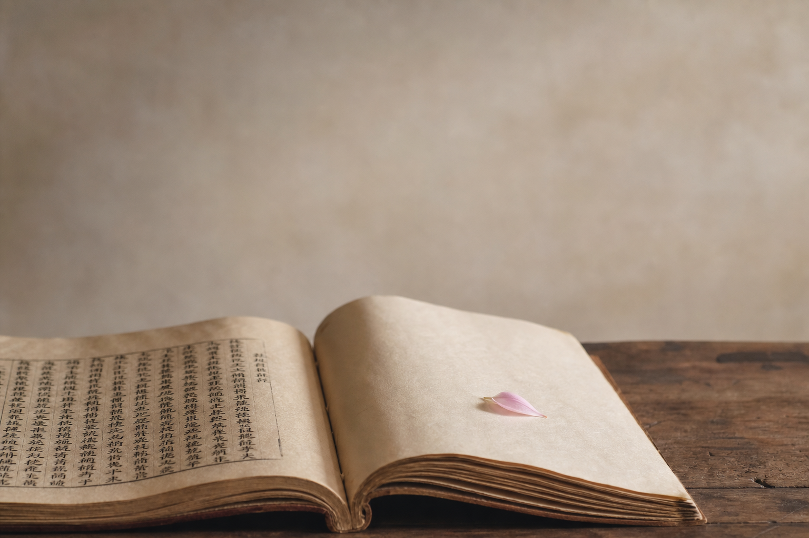

## 今天这段

《素问·上古天真论》,接着上一篇继续:

> 今时之人不然也,以酒为浆,以妄为常,醉以入房,以欲竭其精,以耗散其真,不知持满,不时御神,务快其心,逆于生乐,起居无节,故半百而衰也。

上一段夸古人,这一段骂"今时之人"。

有意思的是,这个"今时"是两千年前的今时。

## "以酒为浆"——我不喝酒,我过了?

等等。如果把"酒"换成需要节制却成了日常必需的东西——

我每天早上没有咖啡会头疼。

我不确定这算不算某种意义上的"以酒为浆"。

## "以妄为常"——我心虚了

西班牙夏天晚上十点天才黑,朋友聚餐从九点半开始。

我已经把"妄"过成"常"了。只是因为周围人都这样,所以不觉得是"妄"。

## 精和真——有限的底牌

中医里的"精"和"真",是人出生时自带的生命资源。有限的,耗一分少一分。

"以欲竭其精,以耗散其真"——不是一次死,是慢慢漏。

熬夜靠咖啡撑,第二天"感觉还行",然后重复。这就是"慢慢漏"。

## 现代人最稀缺的能力

"不知持满"——不知道自己快满了,不知道停。

我们有大量工具帮我们"做更多"——日程软件、效率App、待办清单。几乎没有工具帮我们识别:该停了。

两千年前就写在这里了,没人理。

## 古人说的最让我停住的一句

"务快其心,逆于生乐"

你以为在追快乐,其实在往反方向跑。

刷短视频刷到停不下来——那一刻是爽的。但和你专注做完一件事、把一碗热饭吃进肚子、自然醒的那个早晨——是两种质地完全不同的东西。

## 下一篇预告

第三篇:古人给你排好了时间表,我对进去之后沉默了。女七男八——你现在在哪一格?

