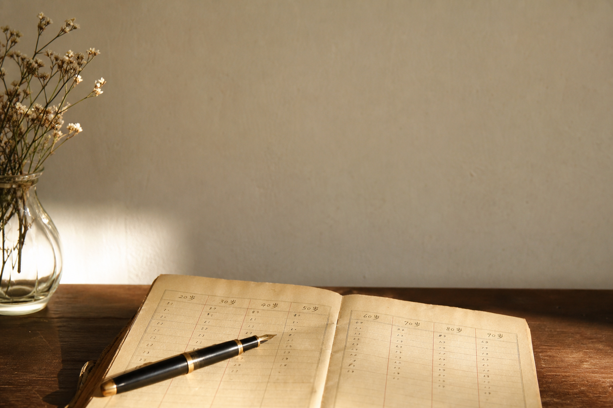
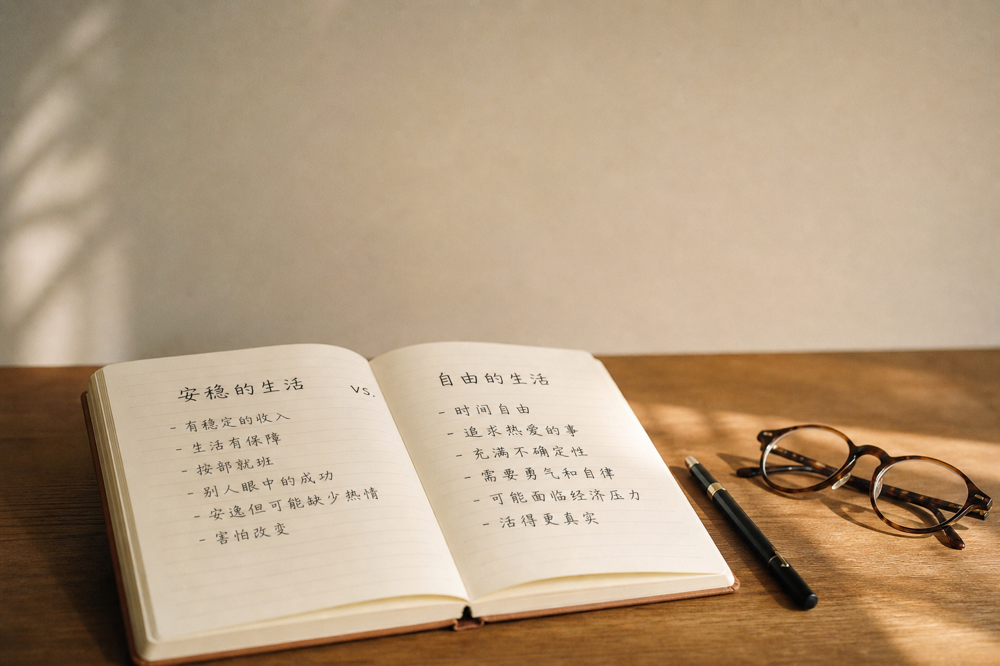

## 今天这段

《素问·上古天真论》,继续往下读:

> 女子七岁,肾气盛,齿更发长。二七而天癸至,任脉通,太冲脉盛,月事以时下,故有子。三七,肾气平均,故真牙生而长极。四七,筋骨坚,发长极,身体盛壮。五七,阳明脉衰,面始焦,发始堕。六七,三阳脉衰于上,面皆焦,发始白。七七,任脉虚,太冲脉衰少,天癸竭,地道不通,故形坏而无子也。

> 丈夫八岁,肾气实,发长齿更。二八,肾气盛,天癸至,精气溢泻,阴阳和,故能有子。三八,肾气平均,筋骨劲强,故真牙生而长极。四八,筋骨隆盛,肌肉满壮。五八,肾气衰,发堕齿槁。六八,阳气衰竭于上,面焦,发鬓颁白。七八,肝气衰,筋不能动。八八,天癸竭,精少,肾脏衰,形体皆极,则齿发去。

我读这两段的时候做了一件事:拿出手机,打开计算器。

## 我对进去,发现自己在五七

女子五七:"阳明脉衰,面始焦,发始堕"。三十五岁。

我今年多少?我不说了,你们自己算。

但有意思的是,读到这里我没有焦虑。我很平静地接受了——不是因为豁达,而是这些年已经隐约感觉到了:体力和以前不一样了。

## 男人的表更残酷

五八:"肾气衰,发堕齿槁"——四十岁开始掉头发。

六八:"阳气衰竭于上,面焦,发鬓颁白"——四十八岁,脸色开始变差,两鬓开始白。

七八:"肝气衰,筋不能动"——五十六岁,筋骨开始不听使唤。

八八:"天癸竭,精少,肾脏衰,形体皆极"——六十四岁,全面进入衰退期。

这张表残酷的地方在于:它不是"老了才老",它是从四十岁就开始,一步一步,每八年下一个台阶。

## 这表准吗?

不是每格都精确到年。但节奏是对的——身体有时间感。

知道倒计时在哪,比不知道好。不是制造焦虑,是知道了还有多少时间,才知道怎么花。

## 下一篇预告

第四篇:《内经》里的四种人,我连最低档都没达到。

