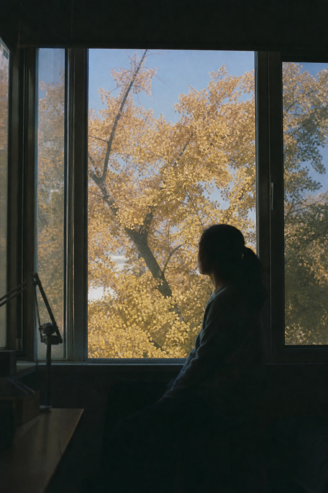
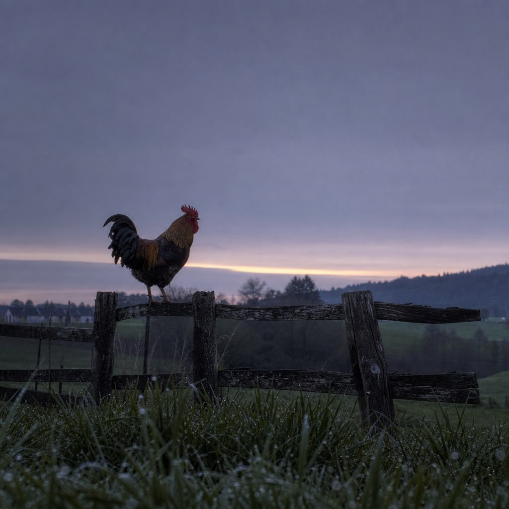
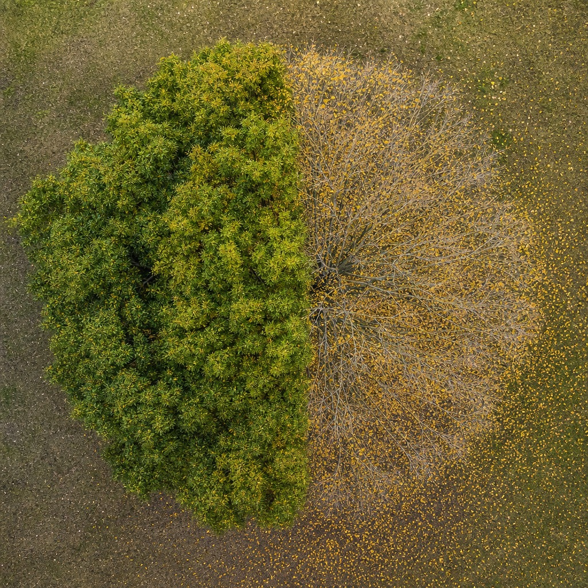
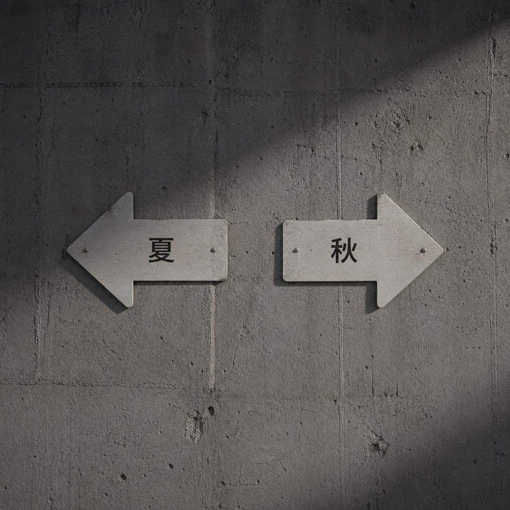

---

title: "第七篇：读到秋天这段，我觉得古人在教我怎么"收""

slug: huangdi-neijing-autumn-rongping

tags: [黄帝内经, 学渣读内经, 四气调神大论, 秋三月容平]

excerpt: "《四气调神大论》秋三月：从向外到向内，学会收敛神气与安宁其志。"

feature_image: images/cover.jpg

status: draft

---

# 第七篇：读到秋天这段，我觉得古人在教我怎么"收"

> 写在最前：这是我读《黄帝内经》的学习笔记，不是教学。我读得慢、读得浅，会读错。看到不对的地方欢迎指正——但请不要把我写的任何内容当作就医建议。

---

## 今天这段

《素问·四气调神大论》，秋天：

> 秋三月，此谓容平。天气以急，地气以明，早卧早起，与鸡俱兴，使志安宁，以缓秋刑，收敛神气，使秋气平，无外其志，使肺气清，逆之则伤肺，冬为飧泄，奉藏者少。

春天发，夏天放，到秋天——转向了。

这一段的关键词，全是反方向的：安宁、缓、收敛、平、无外。

从油门切到了刹车。

---

## 第一遍读：终于有一个季节适合我了

前两季我读完都有点心虚。春天说"别挡路"，我挡了；夏天说"别藏着"，我藏了。我这个人天然偏内收、偏安静，跟春夏的"向外"基调总是拧着的。

读到秋天，突然觉得——**这个季节的要求，好像就是我日常的样子。**

"使志安宁"——让心安静下来。
"收敛神气"——把散在外面的精神收回来。
"无外其志"——别让注意力往外跑。

这不就是我每天干的事吗？我的注意力很少往外跑，我倒是经常要强迫自己别太往内缩。

读到这里我有一瞬间的自我安慰：也许我不是不适合春夏，我只是天然是个"秋型人"。

然后马上意识到这个想法有问题——《内经》讲的是四季轮转，不是让你选一个喜欢的季节住进去。你不能永远是秋天。春天该外就得外，夏天该放就得放，到秋天才收。**一年四季只活在"收"的模式里，不叫秋天，叫一直在收缩。**

这个自我安慰维持了大概三十秒就碎了。

---

## "天气以急，地气以明"——天地也换挡了

每一季都从天地开始说。春天是"天地俱生"，夏天是"天地气交"，秋天是：

**"天气以急"**——天气变得急促了。风开始紧，温度开始降。

**"地气以明"**——地气变得清明。夏天的那种蒸腾、潮湿、粘稠感消退了，大地变得清爽、明净。

这两句合在一起，描述的是一种"收紧"的趋势——天在收紧（急），地在变清（明）。跟夏天的"天地气交"那种充盈感完全相反。

天地已经开始收了。你也该收了。

---

## "与鸡俱兴"——这四个字让我笑了

> 早卧早起，与鸡俱兴。

前两季的作息指令都比较抽象："夜卧早起"。到秋天，突然来了一个具体得不得了的参照物——**鸡**。

跟鸡一起起床。

鸡什么时候起？天刚亮就起。不是日出前，不是日出后，是天蒙蒙亮的那个时刻。

为什么春夏都说"夜卧早起"，到秋天要加一句"与鸡俱兴"？我猜是因为秋天的白昼在变短。春夏"早起"你大概知道什么时候——天亮得早嘛。秋天天亮得越来越晚，"早起"到底是几点就需要一个参照了。鸡是最准的生物钟，它不看手表，它看天光。

古人给了你一个不用时钟就能校准作息的方法：别定闹钟，看鸡。

我在西班牙没有鸡。但这个思路我记下了：秋天的"早"不是固定时间，是跟着天光走的动态时间。

---

## "以缓秋刑"——秋天的底色是杀

这四个字是我在这段里停留最久的地方。

> 使志安宁，以缓秋刑。

让心安宁下来，用来缓和秋天的"刑"。

**刑**。杀伐的意思。

秋天在古人眼里不是"金黄色的浪漫季节"。秋天的底色是**肃杀**——树叶掉了，草枯了，虫死了，白天短了。天地在做一件事：该杀的杀、该收的收、该了结的了结。

这就是"秋刑"。秋天在行刑。

那人怎么办？你不是天地，你不能跟着杀。你能做的是"缓"——缓和这个杀气对你内心的影响。

**"使志安宁，以缓秋刑"**——你安静下来，不是因为你想安静，而是因为外面的气场在肃杀，你不安静就会被带进去。

这让我想到秋天那种莫名的低落感——不是因为发生了什么坏事，就是觉得什么东西在消退、在收缩。古人不会说这是"季节性抑郁"，他们会说这是"秋刑"的影响，而应对的方法不是对抗它，是**不跟着它走太深**。

缓，不是消除。你消除不了秋天的肃杀，但你可以让它慢一点到达你的内心。

---

## "无外其志"——跟夏天完全反过来

上一篇夏天说"若所爱在外"——好像你最在意的东西在外面。

秋天说"无外其志"——**别让你的志向外跑。**

一百八十度掉头。

夏天叫你打开，秋天叫你关上。夏天叫你往外看，秋天叫你往内看。

读到这里我才意识到，这两季的指令之所以完全相反，是因为天地的方向完全相反。不是古人朝令夕改——**是天转了，你该跟着转。**

如果你夏天收着、秋天还在往外放，你就跟天地拧着。拧的后果——伤。

---

## 后果链继续

> 逆之则伤肺，冬为飧泄，奉藏者少。

秋天对应肺。逆着来伤肺。

"冬为飧泄"——冬天会拉肚子。飧泄是吃什么拉什么，消化不了。

"奉藏者少"——给冬天的"藏"提供的能量变少了。

接力棒又传了：春→夏→**秋**→冬。秋天摔了，冬天的"藏"就不够用。而冬天藏不够——按照我在第五篇理解的循环——明年春天的"发陈"也就没东西可发。

四季是一个闭环。任何一个环节掉链子，影响的不只是下一季，是整个循环。

---

## 这一段暂时的理解

用大白话复述（依然标注"未必对"）：

> 秋天是一年的拐点。春天往外推、夏天往外放，到秋天要掉头——把散在外面的注意力、精神、气都收回来。不是因为你想收，是因为天地已经在收了：风紧了、气清了、白昼短了、万物开始凋零。秋天的底色是肃杀，你不收着点就会被这个气场带走。具体操作：跟着天光作息（鸡起你也起），让内心安定，别到处分散注意力。秋天做好了，冬天才有东西可以"藏"。

---

## 留的坑

1. **"秋刑"跟五行的"金"有什么关系？** 秋天对应金，金主肃杀、主收。这个"刑"是金的属性吗？
2. **为什么秋天逆之伤肺，后果是冬天"飧泄"（拉肚子）？** 肺和消化系统有什么关系？在中医里肺和脾/大肠的关系我还没概念。
3. **"收敛神气"——"神气"在这里是一个词还是两个词？** 是"精神之气"还是"神"和"气"两样东西都要收？
4. **四季闭环的猜想对不对？** 我说秋收不够→冬藏不够→春发不了——这个循环是我推理出来的，原文没直接说。等读完冬天再验证。

---

下一篇继续《四气调神大论》，最后一季：

> 冬三月，此谓闭藏。水冰地坼，无扰乎阳……

春发、夏放、秋收——冬天叫"闭藏"，关门藏东西。

而且这段里有一句我从没见过的描写："使志若伏若匿，若有私意，若已有得"。

听起来很有意思。下篇见。
