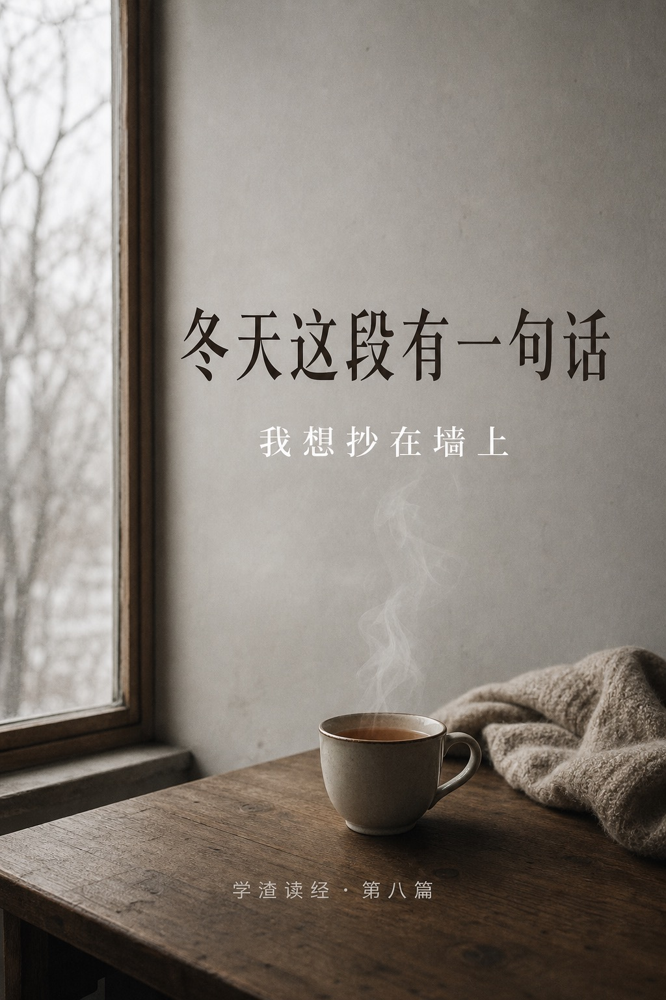
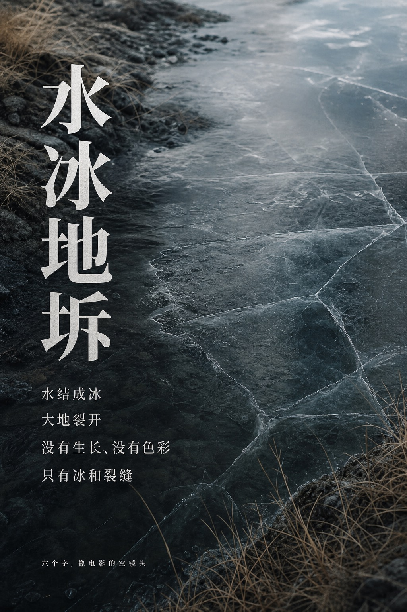
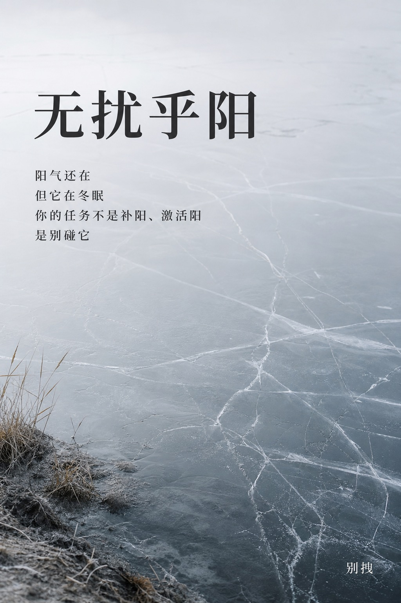
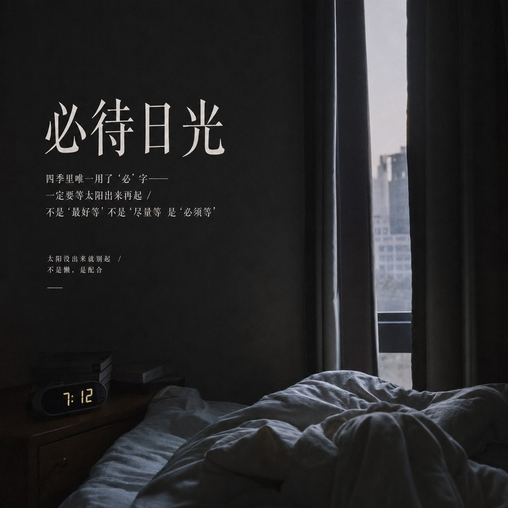
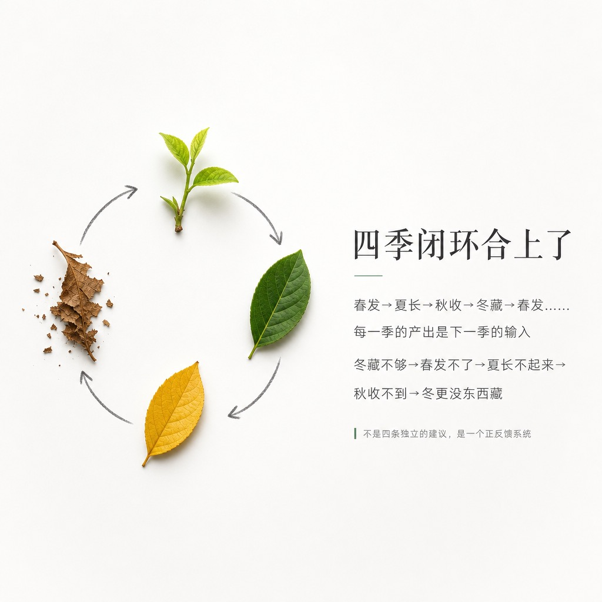
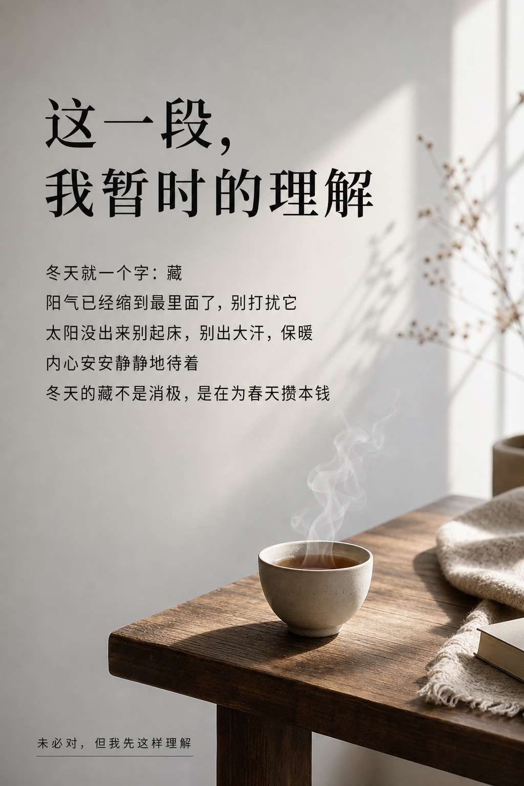
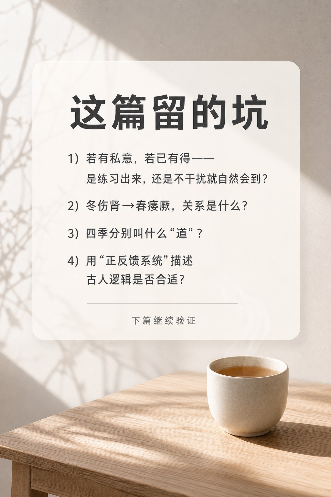
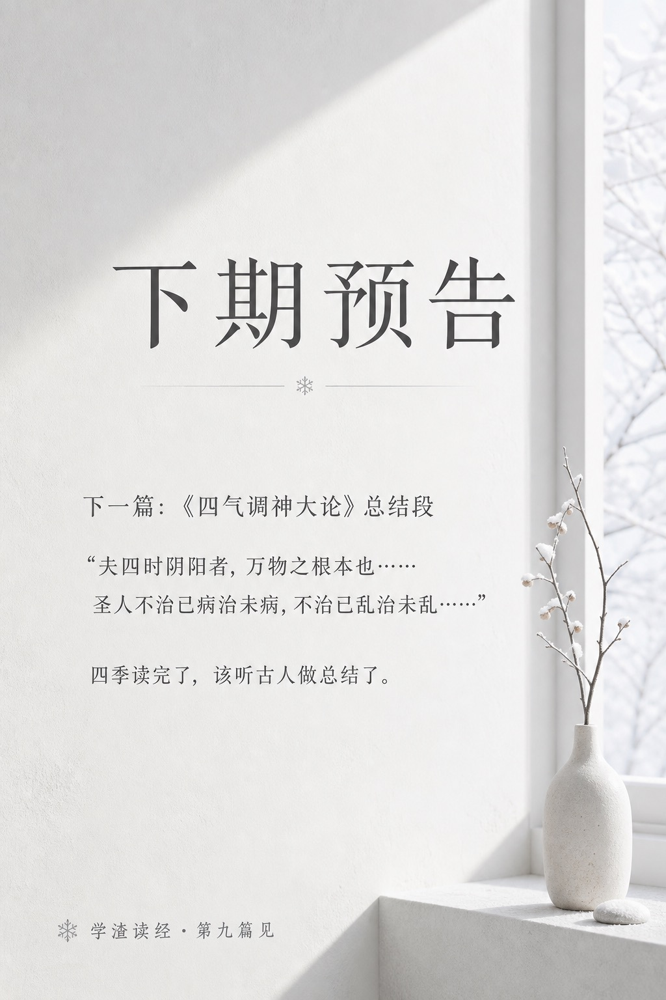

> 写在最前：这是我读《黄帝内经》的学习笔记，不是教学。我读得慢、读得浅，会读错。看到不对的地方欢迎指正——但请不要把我写的任何内容当作就医建议。

---

---

## 今天这段

《素问·四气调神大论》，冬天：

> 冬三月，此谓闭藏。水冰地坼，无扰乎阳，早卧晚起，必待日光，使志若伏若匿，若有私意，若已有得，去寒就温，无泄皮肤，使气亟夺，此冬气之应，养藏之道也。逆之则伤肾，春为痿厥，奉生者少。

四季读到最后一季。

春发、夏放、秋收——冬天：关门。

---

## 第一遍读：这是四季里最安静的一段

春天的画面是万物萌发，夏天是满开怒放，秋天是肃杀清明。

冬天的画面是：

**"水冰地坼"**——水结成了冰，大地裂开了。

六个字，画面感极强。没有生长，没有色彩，没有声音。只有冰和裂缝。

天地在这个季节做的事情，用一个词概括就是"闭"——关上了。不生了，不交了，不急了，关了。

读完这六个字，我坐在西班牙冬天的暖气房里，忽然觉得古人写文章像拍电影——先给你一个远景空镜头，让你感受到那个季节的气场，然后才说：在这样的气场里，你应该怎么活。

---

## "无扰乎阳"——冬天最重要的三个字

> 无扰乎阳。

整个冬天的养生核心，我觉得就是这四个字。

春天阳气往外冒，你别挡。夏天阳气往外散，你别藏。秋天阳气开始收，你跟着收。

**到冬天，阳气已经缩回去了，藏在最里面——你别去打扰它。**

"无扰乎阳"不是说冬天没有阳气。恰恰相反——阳气还在，但它在冬眠。你的任务不是"补阳"，不是"激活阳"，是**别碰它**。让它安安静静地藏着。

我突然想到，现代冬天的很多"养生"行为，可能都在"扰阳"：大冬天去做高强度运动出一身汗、泡完桑拿冲冷水、半夜不睡熬到两三点——每一样都在把藏好的阳气往外拽。

"无扰乎阳"——别拽。

---

## "必待日光"——四季唯一一次用了"必"

> 早卧晚起，必待日光。

春天"夜卧早起"，夏天"夜卧早起"，秋天"早卧早起"。到冬天——**早卧晚起**。

睡得最早，起得最晚。

而且注意：这是四季里唯一一次用了**"必"**字。必待日光——一定要等到太阳出来再起。不是"最好等"，不是"尽量等"，是"必须等"。

古人措辞一向克制。前三季都没用"必"，到冬天突然来一个——说明这件事在他们看来是底线级别的。

太阳没出来就别起。

我想了想我冬天的作息。七点闹钟响，窗外还是黑的，爬起来做事。这在古人看来，大概就是"扰阳"——天都没亮你就把自己从被子里拽出来，阳气跟着被拽了一把。

冬天天亮得晚，你就该起得晚。不是懒，是配合。

---

## "若有私意，若已有得"——我想抄在墙上的一句

读到冬天这段，所有具体动作都不意外：早睡晚起、保暖、别出汗。

但有一句话让我停了很久：

> 使志若伏若匿，若有私意，若已有得。

翻译过来大意是：让你的心志像潜伏着、藏匿着一样，好像怀揣着一个不愿告人的念头，好像已经得到了你想要的东西。

前半句好理解——伏、匿，藏起来。冬天嘛，万物都藏了，你的心也藏着。

**后半句我读了很多遍：若有私意，若已有得。**

"若有私意"——好像有一个只属于自己的、不打算跟任何人分享的心事。那种心里揣着一个秘密的感觉。

"若已有得"——好像已经得到了。不是在追求，不是在期待，是已经拿到了。那种不需要再向外求的安定感。

这两句合起来描述的是一种什么状态呢——**你心里有东西，但你不说，也不需要说。你不缺什么，也不追什么。你就那么安安静静地待着，像一个已经收到了礼物但还没拆的人。**

这是我在整本《四气调神大论》里读到的最美的一句话。

不是因为文学，是因为那种状态我太陌生了。我的日常是：永远在追下一个、永远觉得还差一点、永远在向外展示"我在做事"。"若已有得"的状态，我几乎没体验过。

古人说冬天应该活在这种状态里。

我不知道这算不算养生。但就算不算，我也想试试。

---

## "无泄皮肤，使气亟夺"——身体层面的"别散"

> 去寒就温，无泄皮肤，使气亟夺。

避开寒冷、寻找温暖、不要让皮肤大量出汗——否则气就会被快速夺走。

"亟夺"是急速丧失的意思。冬天出大汗，气就急速流失。

跟夏天的"使气得泄"完全反过来。夏天说"让气散出去"，冬天说"别让气散出去"。

同一个系统，夏天开阀，冬天关阀。

这又验证了一件事：四季的指令之所以不同，不是因为道理变了，是因为**方向变了**。道理始终是一个——跟天地同步。天地开你就开，天地关你就关。

---

## 后果链闭合了

> 逆之则伤肾，春为痿厥，奉生者少。

冬天对应肾。逆着来伤肾。

"春为痿厥"——春天会出现痿软无力、手脚厥冷的症状。

"奉生者少"——**能奉献给春天"生发"的能量变少了。**

读到这里我几乎要拍桌子。

第五篇我说过："发陈"——春天发散的是冬天积下来的旧东西。当时我问了一个问题：如果冬天什么都没攒，春天能发什么？

现在答案来了。冬天逆着来，"奉生者少"——**你攒不够，春天没东西发。**

四季的闭环在这里完全合上了：

**春发 → 夏长 → 秋收 → 冬藏 → 春发……**

每一季的产出，是下一季的输入。冬藏不够 → 春发不了 → 夏长不起来 → 秋收不到 → 冬更没东西藏 → 循环退化。

反过来，每一季做对了：冬藏足 → 春发旺 → 夏长盛 → 秋收丰 → 冬更有东西藏 → 循环增强。

这不是四条独立的养生建议。**这是一个正反馈/负反馈系统。**

---

## 这一段暂时的理解

用大白话复述（依然标注"未必对"）：

> 冬天的核心就一个字：藏。阳气已经缩到最里面了，你别去打扰它。具体操作：太阳没出来别起床，别出大汗，保暖，内心安安静静的，像一个已经拿到了自己想要的东西、什么都不用再追的人。冬天的"藏"不是消极，是在为春天攒本钱——你现在藏得够，明年春天才有东西可发。四季是一个闭环：发→长→收→藏→发。每一季做好了，下一季才撑得住。

---

## 留的坑

1. **"若有私意，若已有得"——这是一种可以练习的状态吗？** 还是说它描述的是冬天人体自然应有的状态，你不"做"也会到，只要你别干扰？
2. **冬天伤肾→春天痿厥，这个因果链是什么？** 肾和四肢无力（痿）、手脚冰冷（厥）有什么关系？肾主什么？
3. **"养藏之道"——其他三季分别叫什么"道"？** 春天叫"养生之道"，夏天叫"养长之道"，秋天的我漏了——下次回去补。如果四季分别是养生、养长、养收、养藏，那"生长收藏"就是这篇的完整模型。
4. **四季闭环是正反馈系统——这个理解对吗？** 我是用现代系统论的词在描述古人的逻辑，不知道这样类比合不合适。

---

下一篇继续《四气调神大论》的最后一段——不是某个季节了，是四季之后的总结：

> 夫四时阴阳者，万物之根本也……圣人不治已病治未病，不治已乱治未乱……

"治未病"这三个字，可能是整本《内经》最出圈的一句话。

下篇见。
