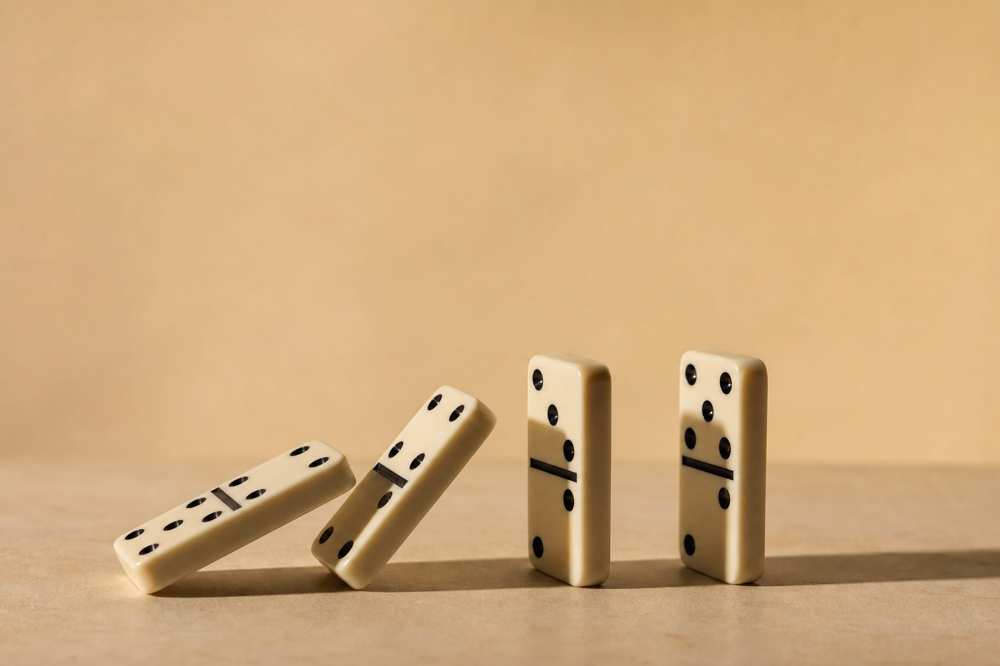
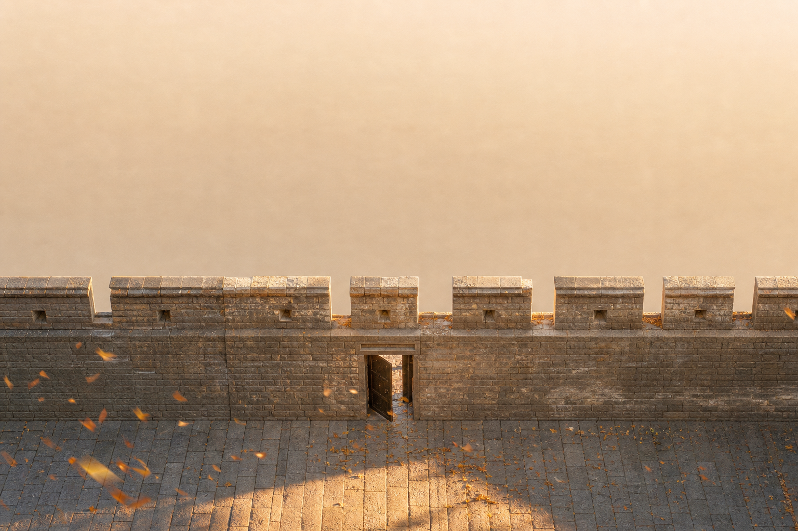
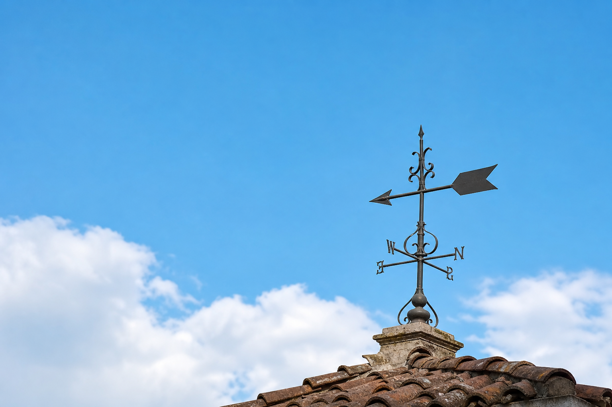
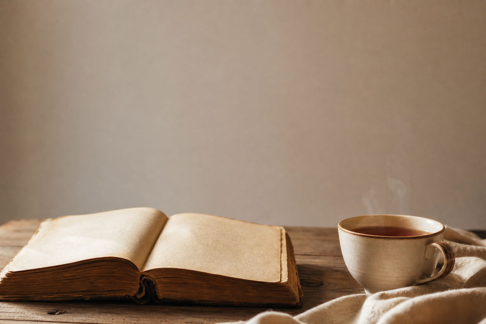

## 今天这段

《素问·生气通天论》,论风邪:

> 故风者,百病之始也,清静则肉腠闭拒,虽有大风苛毒,弗之能害,此因时之序。故病久则传化,上下不并,良医弗为。

> 因于露风,乃生寒热。是以春伤于风,邪气留连,乃为洞泄;夏伤于暑,秋必痎疟;秋伤于湿,冬必咳嗽;冬伤于寒,春必温病。

"风为百病之始"——中医最著名的论断之一。我从小听到大,但从来没认真想过:为什么是风?

## 风是载体

寒、热、湿、燥都可能跟着风进来。风是第一道门缝。

不是说风本身有多厉害,而是它是"最先打开那道门"的东西。门一开,后面什么都跟着进来了。

## 春伤于风,邪气留连

乃为洞泄;夏伤于暑,秋必痎疟;秋伤于湿,冬必咳嗽;冬伤于寒,春必温病。

一个季节的债,下个季节还。

## 风的特点是善行数变

来得快,位置不定。今天头痛明天关节痛后天皮肤痒。

这就是为什么风邪最难防——它不定点攻击。

## 防风就是守住门

清静则肉腠闭拒。身体状态好,风进不来。

现代人最容易被风击中的时候:熬夜后、大汗后、洗完澡没擦干。腠理开了,风就进去了。

## 一条链:风入→传变→难治

故病久则传化,上下不并,良医弗为。

等到病传变了,好医生也难治。所以防风的本质不是防"风",是守住自己的状态。

## 下一篇预告

第十三篇:阳气崩溃的几种死法,古人写得像病历——煎厥与薄厥。

