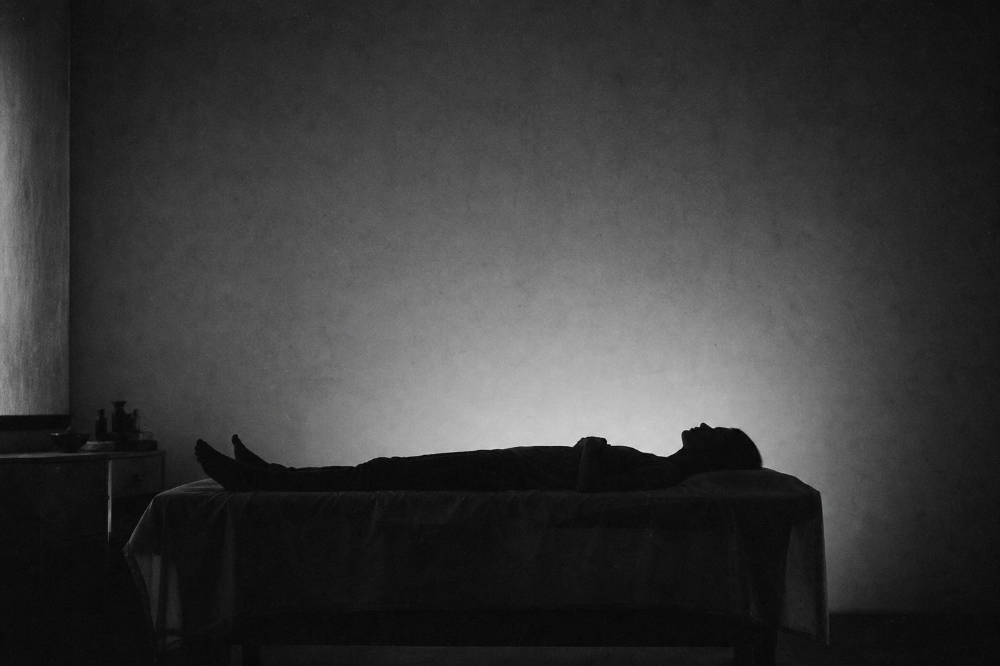
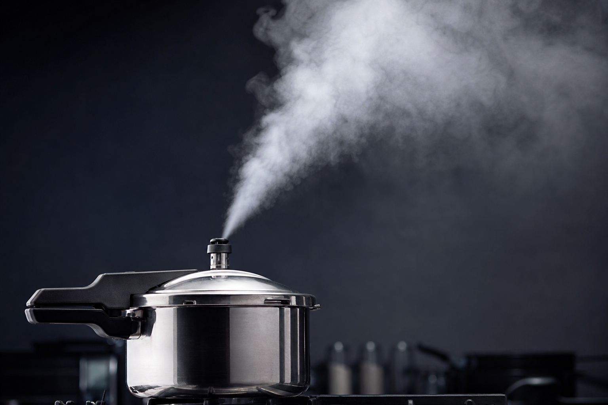

## 今天这段

《素问·生气通天论》,阳气受损的各种情形:

> 阳气者,烦劳则张,精绝,辟积于夏,使人煎厥。目盲不可以视,耳闭不可以听,溃溃乎若坏都,汩汩乎不可止。

> 阳气者,大怒则形气绝,而血菀于上,使人薄厥。有伤于筋,纵,其若不容。汗出偏沮,使人偏枯。汗出见湿,乃生痤疿。

> 高梁之变,足生大丁,受如持虚。劳汗当风,寒薄为皶,郁乃痤。

前两篇讲了阳气"应该怎样"——像太阳、要致密、要卫外。这一篇开始讲"搞砸了会怎样"。

读完我的感受是:古人写病理像写灾难片剧本。

## 煎厥——慢慢煮干

烦劳则张,精绝,辟积于夏,使人煎厥。

什么叫煎厥?煎,就是小火慢熬。

长期疲劳消耗,阳气一直在不该开的时候开着。到夏天外面一热,内外夹击,整个系统就崩了——目盲不可以视,耳闭不可以听。这不是突然暴毙,是慢慢熬干了。

## 薄厥——瞬间爆掉

大怒则形气绝,而血菀于上,使人薄厥。

薄,是"迫",突然的、猛烈的。大怒之下,气血突然冲上来——血压飙高,血管爆了。中医两千年前就写清楚了。

有伤于筋,纵,其若不容——中风后遗症,半身不遂,肌肉控制不了。

## 两种死法的共同点

都是阳气出了问题。一个是慢性耗尽——煎厥;一个是急性爆发——薄厥。

一个是生活把你慢慢榨干,一个是情绪让你瞬间爆掉。

## 其他信号

汗出偏沮,使人偏枯——一边出汗一边不出汗,身体已经开始失衡了。这是中风前兆。

高梁之变,足生大丁——吃太好也会出事。营养过剩同样伤阳气。

劳汗当风,寒薄为皶——运动出汗后被风吹,毛孔开了,寒进去了。痤疮、粉刺都可能是这个原因。

阳气不是越多越好,是能收能放、该在的时候在。

