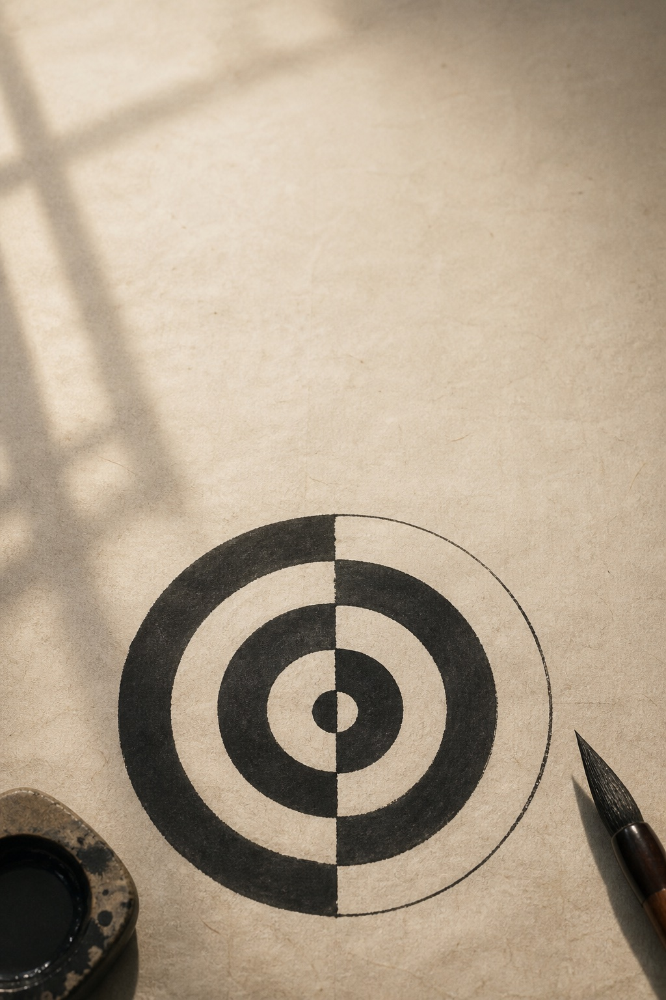
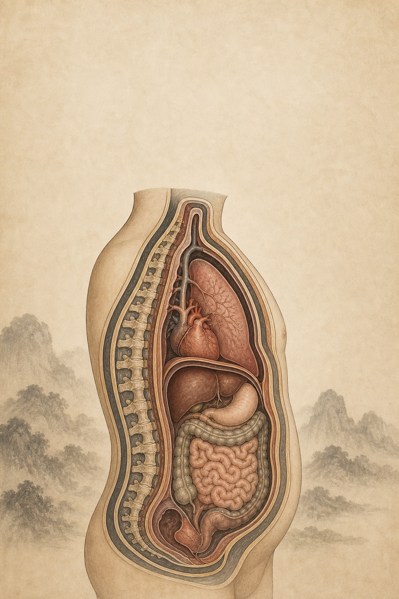
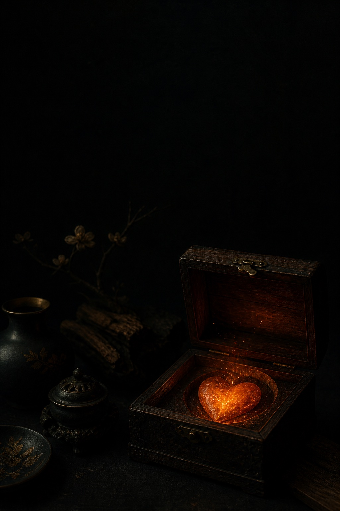
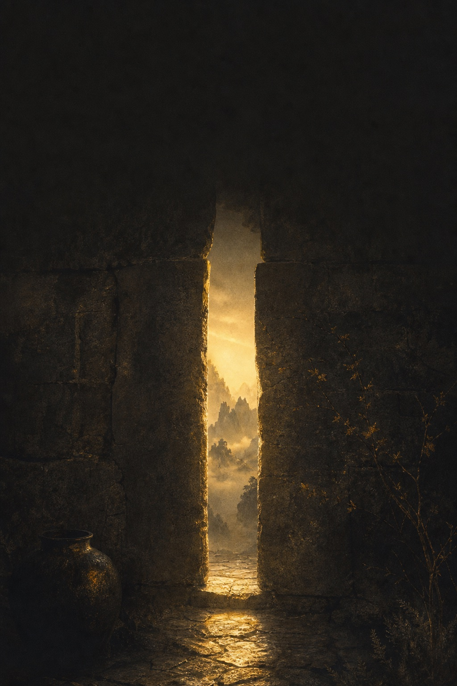

> 写在最前：这是我读《黄帝内经》的学习笔记，不是教学。我读得慢、读得浅，会读错。看到不对的地方欢迎指正——但请不要把我写的任何内容当作就医建议。

---

## 今天这段

《素问·金匮真言论》，阴阳的嵌套结构：

> 故背为阳，腹为阴。脏者为阴，腑者为阳。肝心脾肺肾五脏皆为阴，胆胃大肠小肠膀胱三焦六腑皆为阳。
>
> 故曰：阴中有阴，阳中有阳。平旦至日中，天之阳，阳中之阳也；日中至黄昏，天之阳，阳中之阴也；合夜至鸡鸣，天之阴，阴中之阴也；鸡鸣至平旦，天之阴，阴中之阳也。故人亦应之。
>
> 言人之阴阳，则外为阳，内为阴。言人身之阴阳，则背为阳，腹为阴。言人身之脏腑中阴阳，则脏者为阴，腑者为阳。肝心脾肺肾五脏皆为阴，胆胃大肠小肠膀胱三焦六腑皆为阳。故知阴中之阴、阳中之阳者，何也？为冬病在阴，夏病在阳，春病在阴，秋病在阳，皆以其所在而施针石也。

《金匮真言论》的最后一段。也是第二阶段的最后一篇。

读到这里，我终于明白了一件第一篇就该明白的事。

---

## 第一遍读："阴中有阴，阳中有阳"

这八个字是整段的核心。

在读这一段之前，我对阴阳的理解是**二分法**：白天是阳，晚上是阴。背面是阳，肚子是阴。男是阳，女是阴。

一刀两半，清清楚楚。

这段话说：**分完之后，每一半里面还可以继续分。**

> 平旦至日中，天之阳，阳中之阳也。

清晨到中午——属于白天（阳），而且是白天里最阳的部分（阳中之阳）。太阳在升，气温在涨，能量在往上走。

> 日中至黄昏，天之阳，阳中之阴也。

中午到傍晚——还是白天（阳），但已经是白天里偏阴的部分（阳中之阴）。太阳开始落，气温开始降，虽然还没到晚上，但方向已经转了。

> 合夜至鸡鸣，天之阴，阴中之阴也。

前半夜——属于夜晚（阴），而且是最阴的部分（阴中之阴）。最黑、最冷、最沉。

> 鸡鸣至平旦，天之阴，阴中之阳也。

后半夜到天亮前——还是夜晚（阴），但阳气已经在里面酝酿了（阴中之阳）。天还没亮，但鸡已经叫了——它感受到了黑暗里正在萌动的阳。

---

## 这不是二分法，是分形

读到这里我突然理解了——**阴阳不是一把刀把世界切成两半，而是一个可以无限嵌套的结构**。

白天是阳，但白天里有阳（上午）有阴（下午）。
夜晚是阴，但夜晚里有阴（前半夜）有阳（后半夜）。

如果继续分下去呢？上午里也有阴阳——刚日出的时候阳气正在升（阳中阳中之阳），快到中午的时候阳气到顶即将转（阳中阳中之阴）……

**每一层里面都有阴阳。像俄罗斯套娃——打开一个，里面还有一个。**

这在数学上叫分形（fractal）——整体的结构在局部重复出现。

我不知道古人有没有"分形"的概念，但他们描述的逻辑完全是分形的。

---

## 身体也是套娃

原文接着把这个逻辑搬到了人体上：

**第一层**：外为阳，内为阴。（身体表面 vs 内部）

**第二层**：背为阳，腹为阴。（在"外"这个阳里面再分）

**第三层**：脏为阴，腑为阳。（在"内"这个阴里面再分）

**第四层**：五脏各自的阴阳属性。

层层嵌套。

这意味着：你说一个东西"属阴"或"属阳"，**必须指明是在哪个层面说的**。

心脏是脏，脏属阴——所以心属阴。但心在五脏里主火、对应夏天——从功能上说它又是最"阳"的脏。

**心是"阴中之阳"。**

不矛盾。只是在不同层面上的阴阳判断不同。

这解决了我从第一篇以来的一个困惑：为什么同一个东西，有时候被说成阴，有时候被说成阳？**因为阴阳是相对的，取决于你在哪个层面上比较。**

---

## "故人亦应之"——人跟天是同一个结构

> 故人亦应之。

天有阴中之阴、阴中之阳、阳中之阴、阳中之阳。

人也有。

这不是"人跟天有点像"——这是**同一套结构在不同尺度上的重复**。

天的上午是阳中之阳 → 人体的背部上半部也是阳中之阳。
天的后半夜是阴中之阳 → 人体内部正在酝酿的生机也是阴中之阳。

回想第十篇"皆通乎天气"——人和天是同一个系统。现在补上了结构细节：**不只是大面上相通，是每一层的嵌套结构都对应。**

---

## 最后一句："皆以其所在而施针石"

> 故知阴中之阴、阳中之阳者，何也？为冬病在阴，夏病在阳，春病在阴，秋病在阳，皆以其所在而施针石也。

最后一句话回到了实操：**知道这些嵌套结构是为了什么？为了治病。**

冬天的病在阴的部分，夏天的病在阳的部分。你知道病在阴阳的哪一层，才知道针灸应该扎在哪。

这是整个第二阶段的落脚点——**所有理论最终都是为了定位：你的病在哪一层？**

跟GPS一样：光知道"在北京"没用，得知道"在朝阳区、某条街、某栋楼、几层几号"。阴阳的嵌套就是这个功能——从最大的阴阳（白天/夜晚、表/里），一层层缩小范围，最终精确定位到病在哪。

---

## 第二阶段读完了

从第十篇到第十七篇，《生气通天论》和《金匮真言论》两篇读完。

回顾一下这个阶段的收获：

1. **阳气是太阳**——是系统的底层电源，不是可有可无的附加品（第十篇）
2. **阴平阳秘**——不是五五开，阳要"密"、阴要"平"（第十一篇）
3. **风为百病之始**——风是开门的，清静就能关门（第十二篇）
4. **煎厥与薄厥**——阳气崩溃的慢性和急性两种模式（第十三篇）
5. **五味过度伤五脏**——养你的和伤你的是同一个东西（第十四篇）
6. **五脏的GPS坐标**——方位、季节、脏腑的多维对应表（第十五篇）
7. **五脏身份证**——颜色、味道、开窍、病在，完整的属性表（第十六篇）
8. **阴阳是套娃**——不是二分法，是可以无限嵌套的分形结构（本篇）

如果用一句话总结第二阶段：**人体是天地的微缩版，阴阳是理解它的坐标系。**

---

## 这一段暂时的理解

用大白话复述（依然标注"未必对"）：

> 阴阳不是非黑即白的二分法——它是一个可以无限嵌套的结构。白天（阳）里有上午（阳中阳）和下午（阳中阴），夜晚（阴）里有前半夜（阴中阴）和后半夜（阴中阳）。人体也是同样的套娃：外是阳内是阴，背是阳腹是阴，脏是阴腑是阳——层层嵌套。知道这个嵌套结构是为了定位：你的病在阴阳的第几层、哪个格子里？定位准了，治疗才有方向。

---

## 留的坑

1. **第三层以下还能怎么分？** 每个脏本身还有阴阳吗？比如"肾阴""肾阳"——这是不是就是再往下分了一层？
2. **"春病在阴，秋病在阳"为什么？** 春天不是阳生发的季节吗，为什么病反而在阴？是因为春天阳气往外走、阴的部分相对空虚？
3. **阴阳的"层数"有没有尽头？** 理论上可以无限分，但实际临床一般分到第几层？
4. **分形的思路对吗？** 我用现代"分形"概念来理解阴阳嵌套，不知道是不是过度类比。

---

第二阶段读完了。

下一个阶段是整个系列最硬的部分——第三阶段，《阴阳应象大论》。

> 阴阳者，天地之道也，万物之纲纪……

从基础框架进入核心理论。据说这一章是《内经》里理论密度最高的一篇。

我做好了被虐的准备。下篇见。

