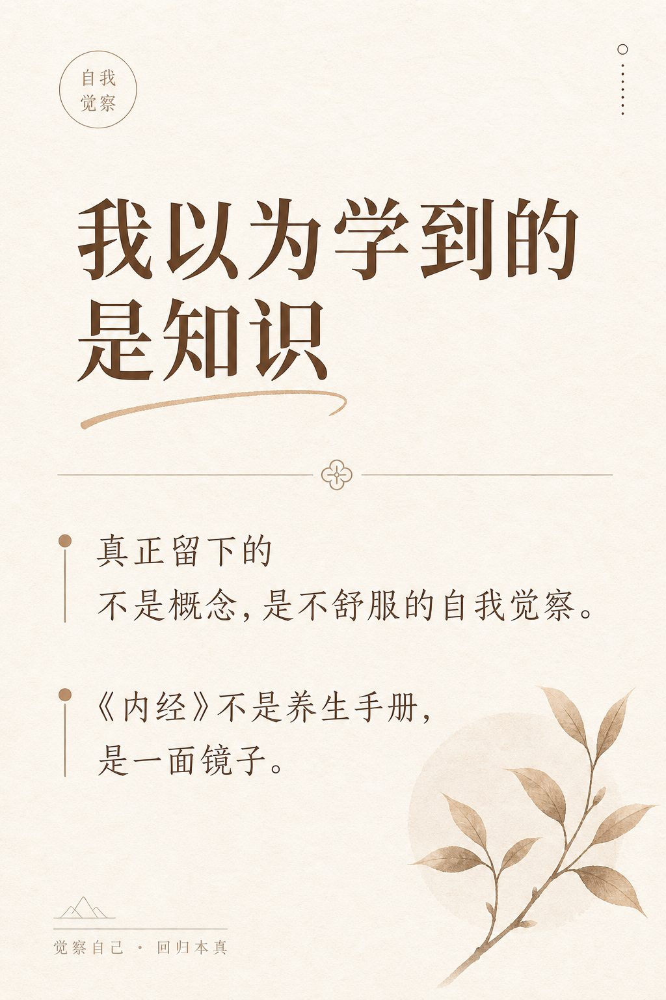
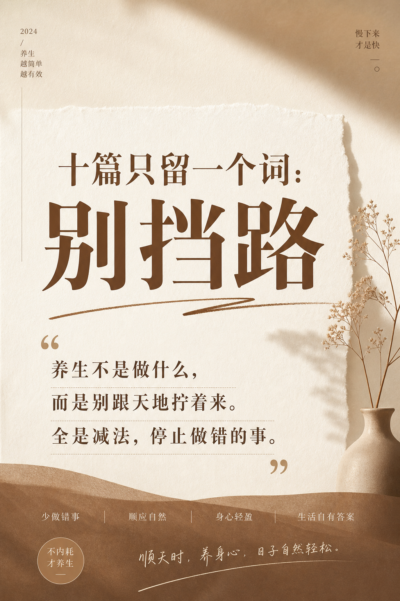
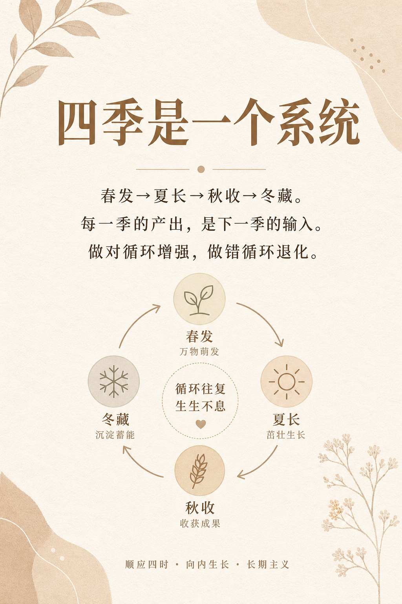
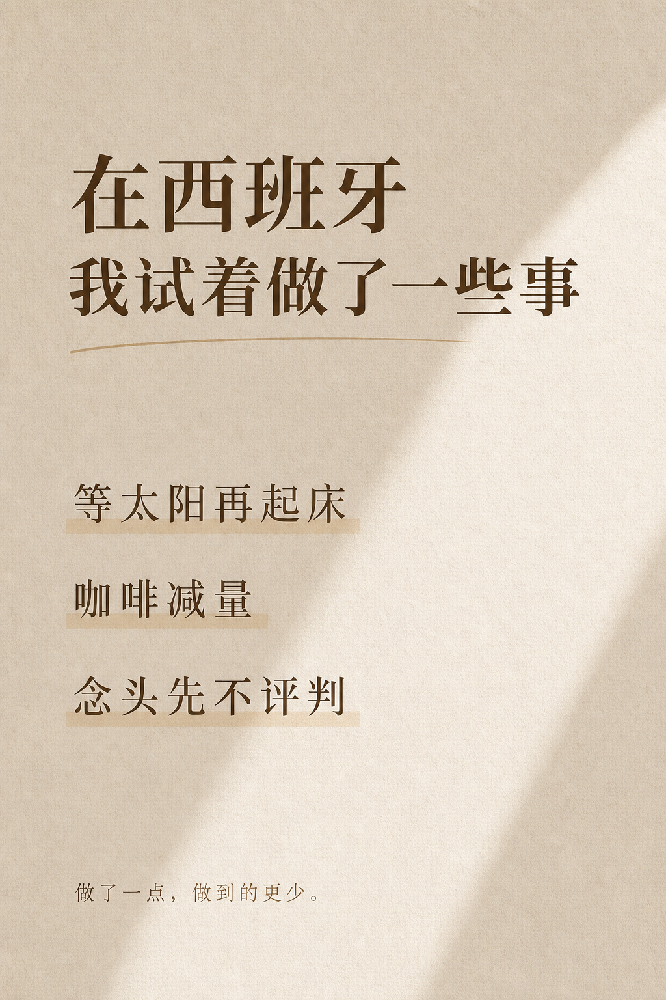
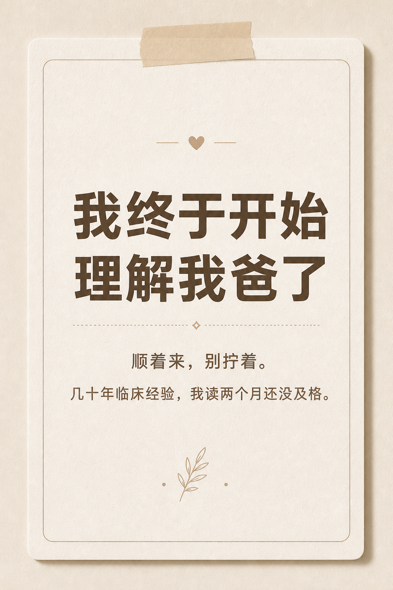
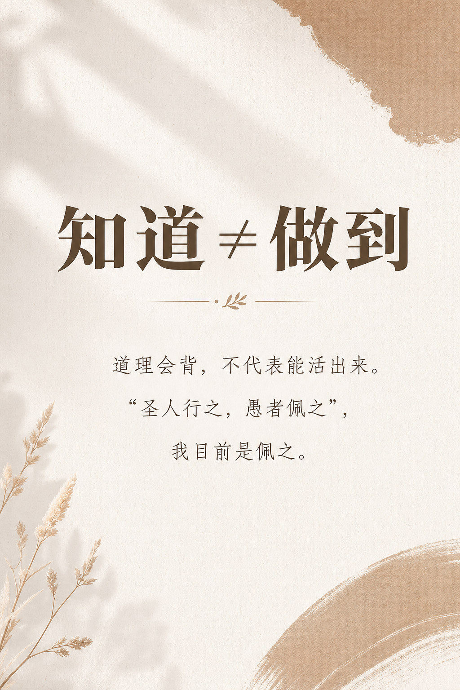
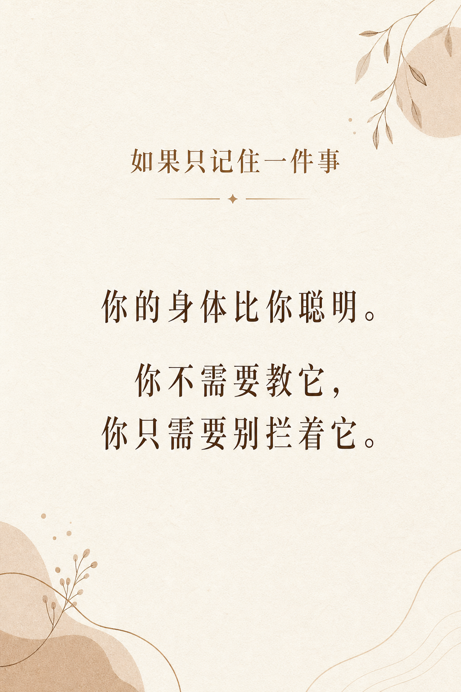
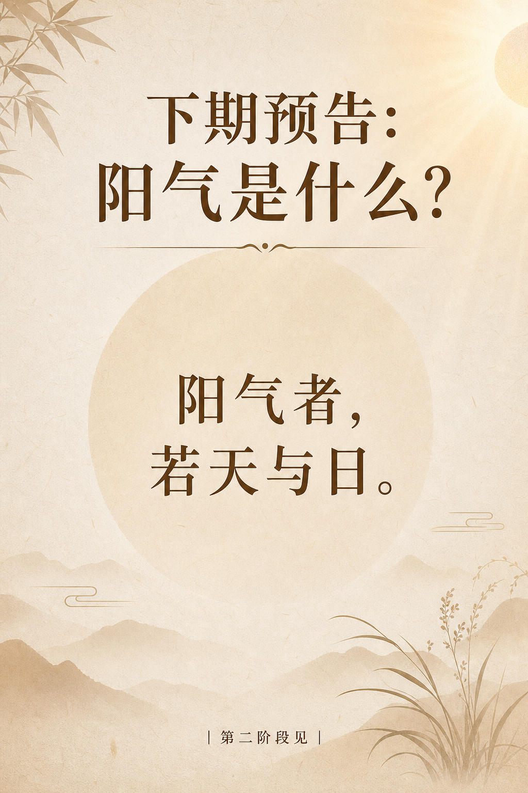

# 第一阶段回头看：读了十篇，我的生活变了吗？

> 写在最前：这是我读《黄帝内经》的学习笔记，不是教学。我读得慢、读得浅，会读错。看到不对的地方欢迎指正——但请不要把我写的任何内容当作就医建议。

---

## 为什么要停下来回头看

十篇写完了。《上古天真论》和《四气调神大论》两篇经文，被我拆成十份啃了大概两个月。

按理说应该直接往下读了——第二阶段《生气通天论》已经在排队了，"阳气者，若天与日"那一句我都预告过了。

但我决定先停一下。

原因很简单：我发现自己在"赶进度"。

写到第八、第九篇的时候，我隐约有一种"快读完第一阶段了"的紧迫感，像期末考试前最后几天，不是在学，是在赶。这恰恰是我在第二篇里照镜子照出来的东西——**务快其心**。

如果读《内经》读出了"赶紧读完"的心态，那大概哪里不对。

所以这一篇不读新原文。回头看看这十篇到底在我身上留下了什么，哪些东西真的进去了，哪些只是"佩之"——挂在嘴上好看，一条也没做。

---

## 一、我以为学到的是知识，其实学到的是一面镜子

十篇读下来，如果有人问我"你学到了什么"，我可能会说一堆：法于阴阳、女七男八、四季闭环、治未病……

但老实说，这些"知识点"我说完就忘。真正留在我脑子里、偶尔会在日常生活中冒出来的，不是哪个概念，而是一种**不舒服的自我觉察**。

第二篇读"以酒为浆"，我想到自己的咖啡因依赖。
第三篇读"女七男八"，我摸了摸自己的头发。
第四篇读"四种人"，我发现自己连最低档的贤人都不算。
第五篇读"生而勿杀"，我意识到自己一年四季都在掐掉刚冒头的念头。

这些不舒服的瞬间，才是真正"进去了"的东西。

《内经》放在整本书开头的这两篇，不是在传授养生技巧，是在递给你一面镜子。它不说"你有问题"，它描述古人是什么样的、今人是什么样的、天地是什么样的——然后你自己照，自己对号入座，自己不舒服。

这种不舒服是有用的。它不催你改变，但它让你看见。

---

## 二、一个词改变了我理解养生的方式

如果十篇只能留一个词，我留"**别挡路**"。

第五篇读春天的时候，我写下了这个总结：养生不是"做什么"，是"别挡路"。

后来发现这三个字可以贯穿整个第一阶段：

**第一篇**，法于阴阳——天地有节律，你跟上就行，别自己另搞一套。
**第五篇**，春天——万物在生发，你别掐。
**第六篇**，夏天——阳气在外散，你别憋。
**第七篇**，秋天——天地在收敛，你别还在往外放。
**第八篇**，冬天——阳气在冬眠，你别去打扰。
**第九篇**，治未病——别做错的事就是最好的预防。

全是减法。

我以前理解的"养生"是加法：吃什么补什么、做什么运动、买什么保健品、下载什么冥想App。是"我要做点什么来让自己更健康"。

《内经》从头到尾说的是反面：**你不需要额外做什么。你只需要停止做错的事。**

天地已经在运转了，你的身体本来就知道该怎么跟。你要做的不是驱动它，是别拖后腿。

这个认知翻转，是我读完第一阶段最大的收获。

---

## 三、四季闭环——我终于理解了"系统"这两个字

读完春夏秋冬四篇之后，我花了很长时间消化的一件事是：**四季不是四条独立的建议，是一个系统。**

春发 → 夏长 → 秋收 → 冬藏 → 春发……

每一季的产出是下一季的输入。冬天藏不够，春天没东西发；春天没发好，夏天长不起来。任何一个环节掉链子，影响的不只是当季，是整个循环。

我在第八篇里写过：这是一个正反馈/负反馈系统。做对了，循环增强；做错了，循环退化。

这个模型改变了我看待很多事情的方式。

比如睡眠。我以前觉得"昨晚没睡好"是一件孤立的事，今天补回来就行了。现在我会想：昨晚没睡好 → 今天精力差 → 做事效率低 → 晚上焦虑 → 又没睡好。这不是一天的问题，是循环在退化。

比如情绪。有段时间我很焦虑，然后用刷手机来缓解焦虑，然后因为浪费时间更焦虑。这也是一个退化循环。

反过来，如果我今晚按时睡了 → 明天精力好 → 做事顺 → 晚上心安 → 又睡好了。增强循环。

四季闭环不只是养生模型，它是一种看待因果关系的方式。

---

## 四、在西班牙，我试着做了一些事

说了这么多"认知"，到底有没有做？

老实交代：做了一点，但很少。做到的更少。

**试过的事：**

**早起看天光。** 冬天读到"必待日光"之后，我有几天刻意等太阳出来再起床。西班牙冬天日出大概八点半，对我来说已经算"晚起"了。头两天感觉不错——不是因为多睡了，是醒来时窗外有光，人的感觉不一样。后来赶上一个工作deadline，这个习惯就断了。

**减少"以酒为浆"式的依赖。** 咖啡没戒掉，但我把每天两杯改成了一杯，而且不在下午喝。这个目前还在坚持。偶尔忍不住还是会喝第二杯，但至少我喝的时候会意识到——"这是我的浆"。有意识地做一件事和无意识地做一件事，感受是不一样的。

**"生而勿杀"——试着不掐念头。** 这个最难。我是一个习惯在想法冒出来的瞬间就评判它的人——"这靠谱吗""这有用吗"。读完第五篇之后，我试着在念头冒出来时先不判断，让它多活一会儿。效果？说不上来。有些念头活了一会儿之后自己死了，有些变成了真的还不错的想法。但更多时候我忘了这回事，又回到了老习惯。

**"若有私意，若已有得"。** 第八篇冬天那句话，我真的想过抄在墙上。有几个晚上，睡前我会试着进入那个状态——不追、不缺、不展示、安静待着。偶尔能进去几分钟。大部分时候脑子里还是跑着明天要做的事。

---

## 五、我爸的影子

写到这里，我想说一件贯穿这十篇但我一直没展开的事。

我爸扎了一辈子针。我从小看他给人治病，看了几十年，觉得自己"懂一点"。读《内经》之前，我以为那个"懂一点"是真的。

读完十篇之后，我发现那个"懂一点"只是皮毛的皮毛。

但有一件事变了：我开始理解他了。

以前他说"冬天别出大汗"，我觉得是唠叨。现在我知道这叫"无扰乎阳"。
以前他说"别老熬夜，肾气耗不起"，我觉得是老一套。现在我知道"女七男八"那张表在后台运转着，耗一分少一分。
以前他经常说"顺着来，别跟身体拧着"，我觉得是鸡汤。现在我知道这六个字差不多就是整个《四气调神大论》的摘要。

他没读过很多书，但他在临床里把这些道理活了几十年。

第一篇我写过：**"知道者"不是知道知识，是知道"道"。** 我爸可能说不清楚"法于阴阳"四个字怎么解释，但他每天的生活方式，就是法于阴阳的样子。

我呢？我能解释，但做不到。

第九篇里古人的原话——**"圣人行之，愚者佩之。"**

我目前是佩之的那个。

---

## 六、还欠自己的债

十篇留下了不少坑，有些是原文层面的：

- "和于术数"到底指什么（第一篇留的，至今没解决）
- "天癸"的确切含义（第三篇留的，模糊理解）
- "内格"是什么（第九篇留的）
- "春夏养阳，秋冬养阴"的两种理解哪个更对（第九篇留的）

但更大的债，不是知识上的，是行动上的。

我知道该早睡，但经常熬到一点。
我知道春天该"缓形"，但我的身体从早到晚都是紧绷的。
我知道该"以恬愉为务"，但我的日常被待办清单填满，恬愉排不进去。
我知道秋天该"无外其志"，但我连吃饭时都在看手机。

这些债不会因为我写了十篇笔记就还清。它们会跟着我进入第二阶段，可能跟着我进入第六阶段，可能跟着我一辈子。

但至少，现在我知道自己欠着。

以前我以为自己活得"还行"。读完这两篇经文之后，我知道"还行"可能只是因为标准太低。

---

## 七、如果只记住一件事

有人如果问我："读了十篇《内经》，就告诉我一件事。"

我会说：

**你的身体比你聪明。它知道什么时候该醒、什么时候该睡、什么时候该动、什么时候该静。你不需要教它。你只需要别拦着它。**

这就是第一阶段教我的全部。

听起来很简单。做起来，我做了两个月，还没及格。

---

第一阶段到此结束。

下一阶段进入《素问·生气通天论》。从"怎么活"进入"为什么"——人体内部的阳气到底是什么？它怎么运作？它跟天地的阳是什么关系？

> 阳气者，若天与日，失其所则折寿而不彰。

阳气就是你身体里的太阳。丢了它，命就暗了。

第二阶段见。
