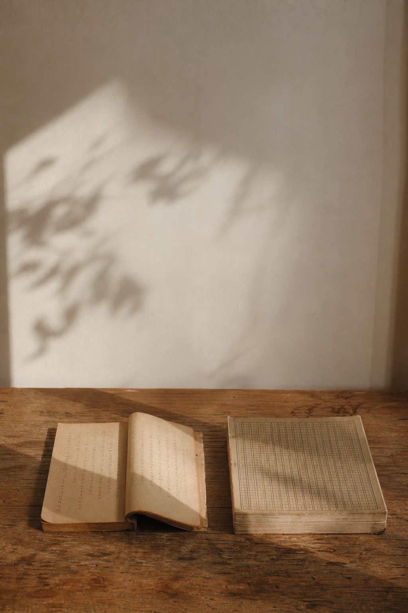
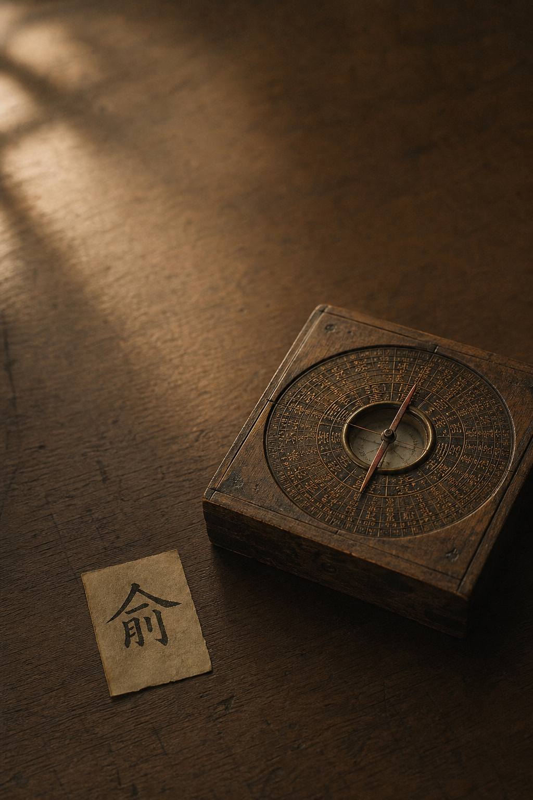
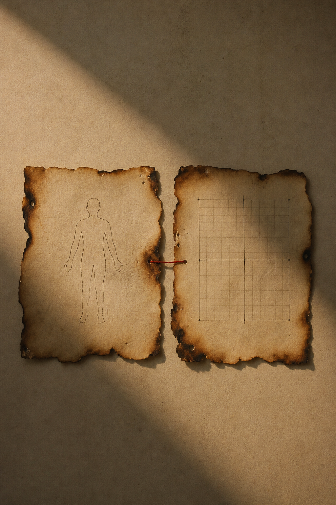

> 写在最前：这是我读《黄帝内经》的学习笔记，不是教学。我读得慢、读得浅，会读错，下面这条把两篇经文缝在一起的"暗线"，也可能是我的过度解读，欢迎指正——但请不要把我写的任何内容当作就医建议。

> 阶段小结：回看第二阶段第十到第十七篇，《素问·生气通天论》+《素问·金匮真言论》。

---

## 为什么停下来回头看

第二阶段读完了，第十到第十七篇，八篇。

按惯例，我读完一段经文会停一下回头看。上一篇《生气通天论小结》我只回看了前五篇（10-14），因为那五篇是一整本《生气通天论》。但第二阶段其实跨了两本经文：

- **《生气通天论》**（10-14）——阳气、阴阳之要、风、煎厥薄厥、五味；
- **《金匮真言论》**（15-17）——五方对应、五脏大表、阴阳嵌套。

写第二本的时候我一直有个隐隐的别扭：这两本，读起来根本不像在讲同一件事。

直到把八篇连起来摆在桌上，我才看出来——它们不是两件事，是一件事的**两半**。而我对其中那一半的理解，从一开始就错了。

---

## 一、上半场和下半场，像两本不相干的书

单看的时候，这两本经文的画风差得离谱。

《生气通天论》是**讲道理**的：阳气像太阳、风是百病之始、别烦劳别暴怒、谨和五味。读起来像一个长辈拉着你的手说"你呀，别这么糟践自己"。

《金匮真言论》是**列表格**的：东方青色入通于肝、其味酸、其畜鸡、其谷麦、其音角、其数八……一连串冷冰冰的对应关系，读起来像在背元素周期表。

一个温情，一个枯燥。我一度怀疑是不是编排顺序出了问题——怎么把一本"劝你好好活"的书，和一本"对应关系清单"摆到了同一个阶段里？

后来才想明白：放在一起，恰恰是对的。

---

## 二、上半场一句话：病，是自伤

《生气通天论》那五篇，我在上一篇小结里抠得很细，这里只压成一句：

**病，多数时候不是天降的，是自伤。**

「虽有贼邪，弗能害也」——邪一直都在，害不了你；真正害得了你的，是「卫气散解，**此谓自伤**」。阳气是你这台机器的电源，风只是替你开门的，煎厥薄厥是你自己点的火，五味过量是你自己下的手。整篇没有一味药，全是"别"：别不清静、别烦劳大怒、别过量。

所以上半场回答的是一个问题：**病是怎么来的？**

答案：很多是你自己招的。

---

## 三、下半场：古人在给五脏画地图

翻到《金匮真言论》，画风突变。它不再讲"为什么会病"，它开始干一件特别理工科的事——**给五脏建坐标系**。

**第十五篇**先立方位和季节：

> 东风生于春，病在肝，俞在颈项……

东南西北中，配上春夏秋冬长夏，再配上肝心脾肺肾，再配上每个脏容易犯病的身体部位。一张方位×季节×脏×俞的坐标表。

**第十六篇**把这张表撑成了巨型：每个脏从颜色、开窍、味道、所属物类、对应的牲畜、谷物、五音、数字，一直到"病在筋/脉/肉/皮毛/骨"，全部归位。我手动列出来，整整九行五列。

**第十七篇**再加一个维度——阴阳嵌套：「阴中有阴，阳中有阳」，白天里还能分出更阳和更阴的时段，分完还能再分。

所以下半场回答的是另一个问题：**身体的事，发生在哪？**

答案：在这张越画越细的地图上。

---

## 四、那张大表，我第一反应是"完蛋，要背"

老实说，读到第十六篇那张九行大表时，我的第一反应是生理性抗拒。

肝青、心赤、脾黄、肺白、肾黑；肝酸、心苦、脾甘、肺辛、肾咸；肝八、心七、脾五、肺九、肾六……

这一刻我仿佛回到高中——又一张要死记硬背的对照表。我甚至开始在脑子里编口诀，想着怎么把"鸡羊牛马猪"和五脏拴一块儿。

读中医，是不是就是把这种表一张一张背下来？背得越多越懂？

我卡在这个念头里好几天，越背越烦，越烦越觉得这玩意儿离我十万八千里——我又不当大夫，记住"肝的数是八"对我有什么用？

直到我把它和上半场摆到一起，才发现自己完全搞反了方向。

---

## 五、转折：它不是用来背的，是一台定位仪

让我转过弯的，是第十五篇那个被我忽略的字——**俞**。

> 东风生于春，病在肝，**俞在颈项**。

古人为什么要费劲记下"肝病容易表现在颈项、心病在胸胁、肺病在肩背"？不是为了考试，是为了**反查**：当颈项出问题，往肝上想；当一个人春天总犯同一类毛病，往肝、往东、往风上想。

这张表的方向，不是"我背下肝属木所以推出青色"，而是反过来——**当某处亮了红灯，顺着表把源头找回去。**

所以那不是一张知识清单，是一台**定位仪**：

- 看见**颜色**不对（脸发青/发黑）→ 定位到脏；
- 嘴里总想吃某个**味**（嗜酸/嗜咸）→ 定位到脏；
- 老在某个**季节**犯病 → 定位到脏；
- 身体某个**部位**反复出事 → 定位到脏。

颜色、味道、季节、部位、声音……全是这台仪器的**输入信号**。表越细，能接住的信号越多，定位越准。

我之前嫌它"信息密度太高"，其实那不是负担，是**精度**。

---

## 六、把两半缝起来：坐标 × 自伤 = 一张报警地图

到这里，两本不相干的书"啪"地合上了。

- **上半场（生气通天论）告诉你**：病是自伤——是你自己在某个地方耗了、过了、动了不该动的。
- **下半场（金匮真言论）告诉你**：自伤了，去哪儿找——顺着这张坐标表，定位到是哪个脏、哪个季节、哪个味道、哪种情绪在出血。

单看上半场，你只知道"我把自己搞坏了"，却不知道坏在哪——像车亮了故障灯却没有仪表盘。
单看下半场，你只有一张冷冰冰的对应表，不知道它指向什么——像有仪表盘却不知道为什么要看它。

**缝起来，它就是一张报警地图**：自伤是"为什么报警"，坐标是"在哪报警"。

第二阶段叫"阳气与阴阳基础"。我现在的理解是：它先用《生气通天论》教你**认账**（病是自己招的），再用《金匮真言论》给你**定位**（招在了哪一格）。先认账，再定位——这套顺序，本身就是中医看人的方式。

---

## 七、阴中有阴——为什么这张地图要画到这么细

那第十七篇的"阴中有阴"又是来干嘛的？我一开始觉得它最玄、最没用。

> 平旦至日中，天之阳，阳中之阳也；日中至黄昏，天之阳，阳中之阴也……

白天是阳，但上午是"阳中之阳"，下午是"阳中之阴"；晚上是阴，但前半夜是"阴中之阴"，后半夜是"阴中之阳"。分了还能再分。

放回"定位仪"的框架里，这一篇突然有用了——它是在告诉你：**这张地图的分辨率，可以无限放大。**

只说"白天/晚上"太粗，定位不到问题。能分到"上午/下午/前半夜/后半夜"，就能把一个反复在某个时段发作的毛病，钉到更小的格子里。阴阳不是非黑即白的二分法，是一把可以一直往下细分的尺子——尺子刻度越密，定位越准。

我用"分形"去类比它（理论上无限可分），不知道算不算过度联想，先记在这儿。但至少，我不再觉得这篇是玄学了——它是在给前面那台定位仪**调焦**。

---

## 八、第二阶段教我的一件事（附：今天能做的两件事）

如果第二阶段只让我留一句话，我会留：

**先认账，再定位。**

我们出了点不舒服，习惯往外找原因（天气、运气、别人）。第二阶段把这个方向掰了回来：先认账——很可能是自伤；再定位——顺着身体给的信号（颜色、味道、季节、犯病的部位），找到是哪一格在出问题。

这不需要你会背那张大表。你只需要知道：**身体一直在用颜色、口味、犯病的时间和部位，给你发信号。** 表是大夫用的，信号是你自己就能读的。

**今天能做的两件事**（先说清楚：这是生活观察，不是治疗方案）：

1. **认账一次。** 挑一个最近反复出现的小毛病，先别怪环境，问自己一句：这是不是我自己在某处耗过头了？（对应上半场"自伤"）
2. **读一个信号。** 留意身体最近有没有固定的"偏好"或"规律"——总想吃某个味、脸色某处发暗、老在某个时段犯困或烦躁。先不下结论，只是记下来。（对应下半场"定位"）

认账让你停止往外甩锅，读信号让你开始往里观察。这两件加起来，差不多就是第二阶段给一个学渣的全部。

---

第二阶段到此结束。

下一阶段是整个系列公认最硬的部分——第三阶段，《素问·阴阳应象大论》。

> 阴阳者，天地之道也，万物之纲纪，变化之父母，生杀之本始……

从"阳气怎么运作"和"五脏在哪"，进入阴阳五行最核心、理论密度最高的一篇。

我做好了被虐的准备。第三阶段见。
